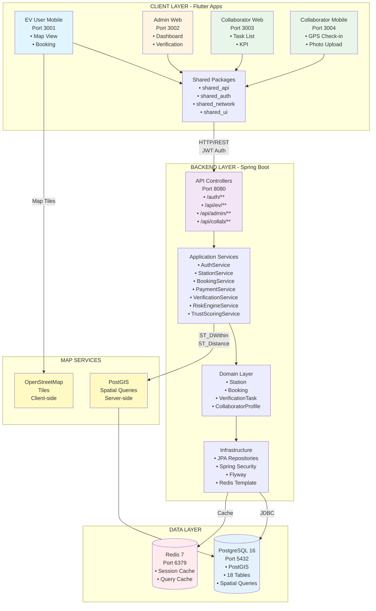
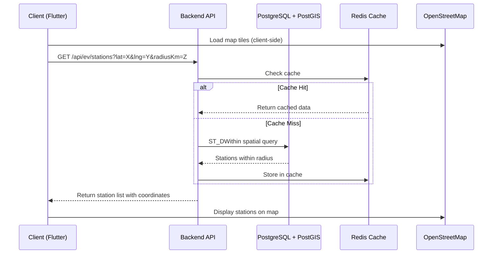
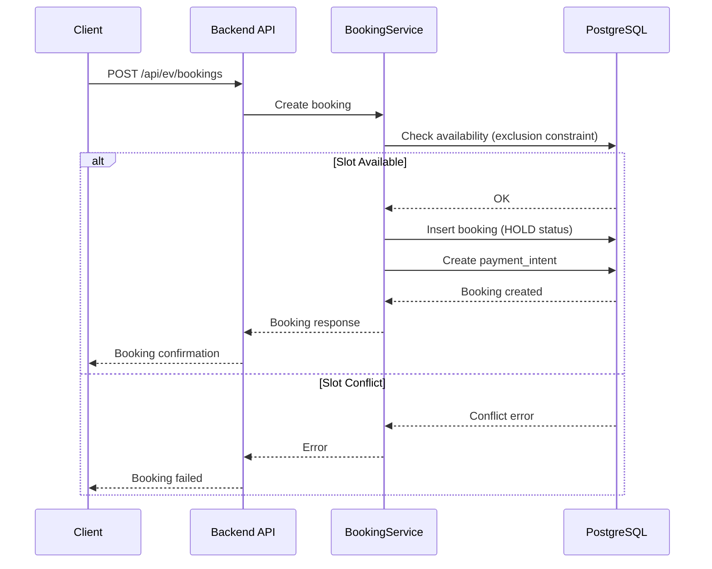
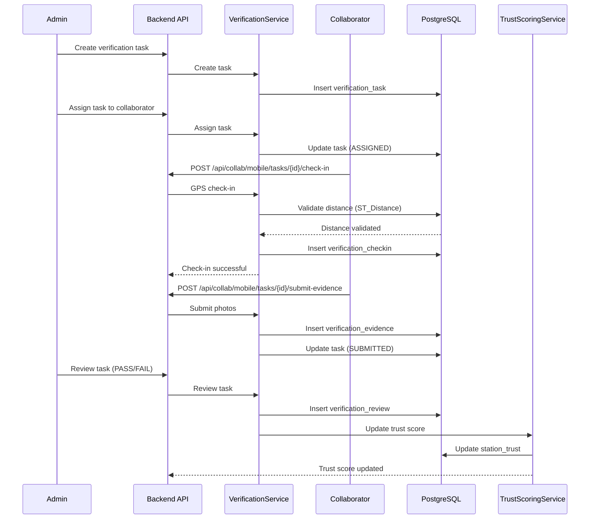

# VoltGo - System Architecture Diagram

## Sơ đồ Kiến trúc Tổng quan (Mermaid)



## Tổng quan Kiến trúc Hệ thống

```
┌─────────────────────────────────────────────────────────────────────────────┐
│                           CLIENT LAYER (Frontend)                           │
│                              Flutter Apps                                   │
├─────────────────────────────────────────────────────────────────────────────┤
│                                                                             │
│  ┌──────────────────┐  ┌──────────────────┐  ┌──────────────────┐        │
│  │  EV User Mobile  │  │  Admin Web       │  │ Collaborator Web │        │
│  │  (Port 3001)     │  │  (Port 3002)     │  │  (Port 3003)     │        │
│  │                  │  │                  │  │                  │        │
│  │ • flutter_map    │  │ • Dashboard      │  │ • Task List      │        │
│  │ • OpenStreetMap  │  │ • Change Request │  │ • KPI            │        │
│  │ • Geolocator     │  │ • Verification   │  │ • Profile        │        │
│  │ • Booking        │  │ • Issues         │  │                  │        │
│  └────────┬─────────┘  └────────┬─────────┘  └────────┬─────────┘        │
│           │                      │                      │                  │
│  ┌────────┴─────────────────────┴──────────────────────┴─────────┐       │
│  │                    Shared Packages                              │       │
│  │  • shared_api (OpenAPI Client)                                   │       │
│  │  • shared_auth (JWT Authentication)                              │       │
│  │  • shared_network (Dio HTTP Client)                              │       │
│  │  • shared_ui (UI Components)                                      │       │
│  └──────────────────────────────────────────────────────────────────┘       │
│                                                                             │
│  ┌──────────────────┐                                                      │
│  │ Collaborator     │                                                      │
│  │ Mobile App       │                                                      │
│  │ (Port 3004)      │                                                      │
│  │                  │                                                      │
│  │ • GPS Check-in   │                                                      │
│  │ • Photo Upload   │                                                      │
│  │ • Task List      │                                                      │
│  └────────┬─────────┘                                                      │
│           │                                                                 │
└───────────┼─────────────────────────────────────────────────────────────────┘
            │
            │ HTTP/REST API (JWT Authentication)
            │
┌───────────▼─────────────────────────────────────────────────────────────────┐
│                      BACKEND LAYER (Spring Boot)                             │
│                         Port 8080                                             │
├─────────────────────────────────────────────────────────────────────────────┤
│                                                                             │
│  ┌────────────────────────────────────────────────────────────────────┐   │
│  │                    API Controllers                                 │   │
│  ├────────────────────────────────────────────────────────────────────┤   │
│  │  /auth/**              - Authentication (Login/Register)              │   │
│  │  /api/ev/**            - EV User Mobile API                        │   │
│  │  /api/admin/**        - Admin Web API                             │   │
│  │  /api/collab/mobile/** - Collaborator Mobile API                  │   │
│  │  /api/collab/web/**    - Collaborator Web API                     │   │
│  └────────────────────────────────────────────────────────────────────┘   │
│                                                                             │
│  ┌────────────────────────────────────────────────────────────────────┐   │
│  │              Application Services (Business Logic)                │   │
│  ├────────────────────────────────────────────────────────────────────┤   │
│  │  • AuthService          - User authentication & authorization      │   │
│  │  • StationService      - Station CRUD & versioning                │   │
│  │  • BookingService      - Booking management                        │   │
│  │  • PaymentService      - Payment intent handling                 │   │
│  │  • VerificationService  - Verification task workflow                │   │
│  │  • RiskEngineService   - Risk score calculation                   │   │
│  │  • TrustScoringService - Trust score calculation                  │   │
│  │  • CollaboratorService - Collaborator management                  │   │
│  └────────────────────────────────────────────────────────────────────┘   │
│                                                                             │
│  ┌────────────────────────────────────────────────────────────────────┐   │
│  │              Domain Layer (Clean Architecture)                      │   │
│  ├────────────────────────────────────────────────────────────────────┤   │
│  │  • Station, StationVersion, Booking, PaymentIntent                 │   │
│  │  • VerificationTask, CollaboratorProfile, Contract                 │   │
│  │  • RiskAssessment, TrustBreakdown                                   │   │
│  └────────────────────────────────────────────────────────────────────┘   │
│                                                                             │
│  ┌────────────────────────────────────────────────────────────────────┐   │
│  │              Infrastructure Layer                                  │   │
│  ├────────────────────────────────────────────────────────────────────┤   │
│  │  • JPA Repositories (Data Access)                                  │   │
│  │  • Spring Security (JWT Authentication)                           │   │
│  │  • Flyway (Database Migrations)                                    │   │
│  │  • Redis Template (Caching)                                       │   │
│  └────────────────────────────────────────────────────────────────────┘   │
│                                                                             │
└───────────┬───────────────────────┬───────────────────────────────────────┘
            │                       │
            │                       │
    ┌───────▼────────┐    ┌────────▼────────┐
    │   PostgreSQL    │    │     Redis       │
    │   (Port 5432)    │    │   (Port 6379)   │
    │                 │    │                 │
    │ • PostGIS       │    │ • Session Cache │
    │ • Spatial Queries│   │ • Query Cache   │
    │ • 18 Tables     │    │                 │
    └─────────────────┘    └─────────────────┘
```

## Luồng Dữ liệu Chi tiết

### 1. Client → Backend → Database

```
┌─────────────┐         ┌─────────────┐         ┌─────────────┐
│   Client    │────────▶│   Backend   │────────▶│  PostgreSQL │
│  (Flutter)  │  HTTP   │ (Spring Boot)│  JDBC   │  + PostGIS  │
│             │  JWT    │             │         │             │
└─────────────┘         └──────┬──────┘         └─────────────┘
                               │
                               │ Cache
                               ▼
                        ┌─────────────┐
                        │    Redis    │
                        │   (Cache)   │
                        └─────────────┘
```

### 2. Map Services Integration

```
┌─────────────┐                    ┌─────────────┐
│   Client    │                    │  Backend    │
│  (Flutter)  │                    │ (Spring Boot)│
│             │                    │             │
│ • flutter_map│                   │ • PostGIS   │
│ • OpenStreet│                   │ • ST_DWithin│
│   Map Tiles │                   │ • ST_Distance│
│   (Client)   │                   │   (Server)  │
└─────────────┘                    └─────────────┘
```

**Ghi chú:**
- **Client-side**: Flutter apps sử dụng `flutter_map` với OpenStreetMap tiles để hiển thị bản đồ
- **Server-side**: Backend sử dụng PostGIS để thực hiện spatial queries (tìm trạm trong bán kính, tính khoảng cách)

## Các Module Chính trong Backend

### 1. **Authentication & Authorization**
- JWT-based authentication
- Role-based access control (EV_USER, PROVIDER, COLLABORATOR, ADMIN)
- Spring Security

### 2. **Station Management**
- Versioning pattern (Station + StationVersion)
- Workflow: DRAFT → PENDING → PUBLISHED
- Risk scoring & Trust scoring
- PostGIS spatial queries

### 3. **Booking & Payment**
- Slot-based booking system
- Payment intent simulation
- Booking expiration scheduler

### 4. **Verification System**
- GPS check-in validation
- Photo evidence submission
- Admin review workflow

### 5. **Collaborator Management**
- Location tracking
- Contract management
- Task assignment

## Database Schema Overview

```
┌─────────────────────────────────────────────────────────┐
│                    PostgreSQL 16                        │
│                  + PostGIS Extension                    │
├─────────────────────────────────────────────────────────┤
│                                                         │
│  Core Tables:                                          │
│  • user_account          - User authentication        │
│  • station               - Station identifier          │
│  • station_version       - Station data (versioned)    │
│  • charger_unit          - Individual charging units   │
│  • booking               - Booking records             │
│  • payment_intent        - Payment records             │
│                                                         │
│  Verification Tables:                                   │
│  • verification_task     - Verification tasks          │
│  • verification_checkin  - GPS check-ins                │
│  • verification_evidence  - Photo evidence              │
│  • verification_review    - Admin reviews                │
│                                                         │
│  Collaborator Tables:                                  │
│  • collaborator_profile  - Collaborator info           │
│  • contract              - Collaborator contracts      │
│                                                         │
│  Governance Tables:                                    │
│  • change_request        - Station change requests     │
│  • report_issue          - User reports                 │
│  • station_trust         - Trust scores                 │
│  • audit_log             - Audit trail                  │
│                                                         │
└─────────────────────────────────────────────────────────┘
```

## Technology Stack

### Frontend
- **Framework**: Flutter (Mobile + Web)
- **State Management**: Riverpod
- **Routing**: GoRouter
- **HTTP Client**: Dio
- **Map Library**: flutter_map + OpenStreetMap
- **Location**: geolocator

### Backend
- **Framework**: Spring Boot 3.2.0
- **Language**: Java 17
- **Architecture**: Clean/Hexagonal Architecture
- **Security**: Spring Security + JWT
- **ORM**: JPA/Hibernate
- **Migrations**: Flyway
- **API Docs**: OpenAPI/Swagger

### Database & Cache
- **Database**: PostgreSQL 16
- **Spatial Extension**: PostGIS 3.4
- **Cache**: Redis 7

### Infrastructure
- **Containerization**: Docker + Docker Compose
- **Network**: Bridge network (voltgo-network)

## API Endpoints Summary

### Authentication
- `POST /auth/register` - Đăng ký
- `POST /auth/login` - Đăng nhập

### EV User Mobile (`/api/ev/**`)
- `GET /api/ev/stations` - Tìm trạm trong bán kính (spatial query)
- `GET /api/ev/stations/{id}` - Chi tiết trạm
- `GET /api/ev/stations/{id}/availability` - Lịch trống
- `POST /api/ev/bookings` - Tạo booking
- `POST /api/ev/payments/{id}/simulate-success` - Thanh toán

### Admin Web (`/api/admin/**`)
- `GET /api/admin/change-requests` - Danh sách change requests
- `POST /api/admin/change-requests/{id}/approve` - Phê duyệt
- `GET /api/admin/verification-tasks` - Danh sách tasks
- `POST /api/admin/verification-tasks/{id}/assign` - Giao task

### Collaborator (`/api/collab/**`)
- `POST /api/collab/mobile/tasks/{id}/check-in` - GPS check-in
- `POST /api/collab/mobile/tasks/{id}/submit-evidence` - Upload ảnh
- `PUT /api/collab/mobile/me/location` - Cập nhật vị trí

## Data Flow Examples

### 1. Tìm trạm sạc gần đây (Spatial Query)



### 2. Tạo Booking



### 3. Verification Workflow



## Port Mapping

| Service | Port | Description |
|---------|------|-------------|
| Backend API | 8080 | Spring Boot REST API |
| PostgreSQL | 5432 | Database |
| Redis | 6379 | Cache |
| EV User Web | 3001 | Flutter Web App |
| Admin Web | 3002 | Flutter Web App |
| Collaborator Web | 3003 | Flutter Web App |
| Collaborator Mobile Web | 3004 | Flutter Web App |

