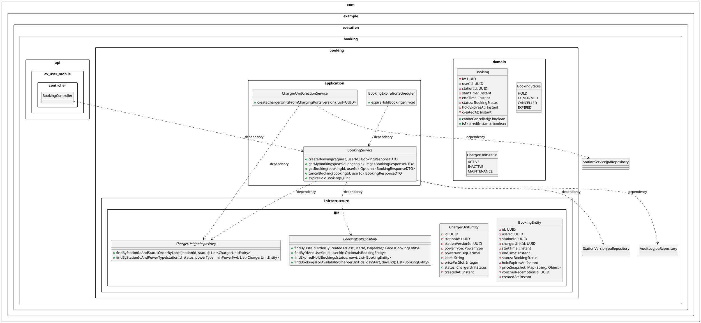
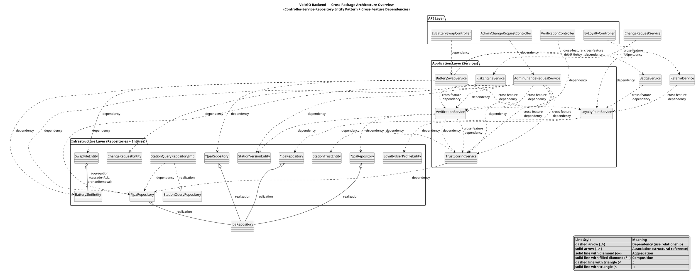

# VoltGO Backend — Section 4.1.3 Detailed Package Design
## UML Class Analysis & Relationship Documentation

**Author:** Generated from source-code inspection of the VoltGO backend  
**Date:** June 13, 2026  
**Project:** VoltGO — EV Charging & Battery Swap Station Management System  
**Backend Stack:** Spring Boot 3.2.0, Java 17, PostgreSQL/PostGIS, Spring Data JPA  
**Total Java Source Files Analyzed:** 437

---

## Table of Contents

1. [Package Overview](#1-package-overview)
2. [Source-Code Findings per Package](#2-source-code-findings-per-package)
3. [UML Relationship Analysis](#3-uml-relationship-analysis)
4. [Relationship Summary Table](#4-relationship-summary-table)
5. [PlantUML Class Diagrams](#5-plantuml-class-diagrams)
6. [Thesis-Ready Academic Explanation](#6-thesis-ready-academic-explanation)
7. [Uncertain Points — Manual Verification Required](#7-uncertain-points--manual-verification-required)

---

## 1. Package Overview

The VoltGO backend adopts a **feature-first layered architecture**. Packages are organized by business domain rather than by technical layer type. Each feature package follows a consistent four-tier structure:

| Layer | Contents | Responsibility |
|-------|----------|----------------|
| **api** | REST Controllers + DTOs | Handle HTTP requests/responses, input validation, API contracts |
| **application** | Service classes + Use Cases | Encapsulate business logic, orchestrate workflows |
| **domain** | Domain objects, enums, value objects | Represent business concepts and rules |
| **infrastructure** | JPA entities, repositories, external adapters | Persistence, database access, external integrations |

The six primary packages analyzed for Section 4.1.3 are:

| Package | Feature | Key Entities |
|---------|---------|-------------|
| `com.example.evstation.booking` | Charging reservation & time-slot booking | BookingEntity, ChargerUnitEntity |
| `com.example.evstation.batteryswap` | Battery swap lifecycle management | BatterySwapReservationEntity, SwapPileEntity, BatterySlotEntity |
| `com.example.evstation.verification` | Field verification of stations | VerificationTaskEntity, VerificationCheckinEntity |
| `com.example.evstation.risk` | Rule-based risk scoring of change requests | RiskAssessment (domain model) |
| `com.example.evstation.trust` | Station trust score computation | StationTrustEntity |
| `com.example.evstation.loyalty` | Points, badges, vouchers, referrals, ratings | LoyaltyUserProfileEntity, VoucherRedemptionEntity |
| `com.example.evstation.station` | Station data governance & CRUD | StationEntity, StationVersionEntity, ChangeRequestEntity |

Supporting packages that interact with the six core packages:

| Package | Role |
|---------|------|
| `com.example.evstation.auth` | Authentication, JWT, user accounts |
| `com.example.evstation.notification` | Push notifications, email |
| `com.example.evstation.payment` | Payment intent management |
| `com.example.evstation.collaborator` | Field collaborator profiles & contracts |
| `com.example.evstation.common` | Shared utilities, error handling, file services |
| `com.example.evstation.config` | Spring configuration |

---

## 2. Source-Code Findings per Package

### 2.1 Charging Booking Package (`com.example.evstation.booking`)

**Purpose:** Manages time-slot reservations for EV charging stations with HOLD/CONFIRMED/CANCELLED/EXPIRED lifecycle states.

#### Domain Classes
- `booking/domain/Booking.java` — Pure domain object with Builder pattern. Encapsulates booking lifecycle rules: `canBeCancelled()`, `isExpired(Instant)`. Contains fields: id, userId, stationId, startTime, endTime, status, holdExpiresAt, createdAt. No persistence annotations.
- `booking/domain/BookingStatus.java` — Enum: HOLD, CONFIRMED, CANCELLED, EXPIRED
- `booking/domain/ChargerUnitStatus.java` — Enum: ACTIVE, INACTIVE, MAINTENANCE

#### Entities (infrastructure.jpa)
- `BookingEntity` — JPA entity mapped to `booking` table. No JPA relationship fields. Foreign keys (stationId, chargerUnitId) are stored as UUID columns. Contains priceSnapshot (JSONB) for storing price calculation details, voucherRedemptionId for loyalty integration.
- `ChargerUnitEntity` — JPA entity mapped to `charger_unit` table. Links to station via stationId and stationVersionId columns. Contains powerType (PowerType enum), powerKw, label, pricePerSlot.

#### Repositories
- `BookingJpaRepository extends JpaRepository<BookingEntity, UUID>` — Methods: `findByUserIdOrderByCreatedAtDesc()`, `findByIdAndUserId()`, `findExpiredHoldBookings()` (custom JPQL query), `findBookingsForAvailability()` (custom JPQL with time-overlap logic).
- `ChargerUnitJpaRepository extends JpaRepository<ChargerUnitEntity, UUID>` — Methods: `findByStationIdAndStatusOrderByLabel()`, `findByStationIdAndPowerType()` (custom JPQL with optional minPowerKw filter).

#### Services
- `BookingService (@Service)` — Core service. Methods: `createBooking()` (creates HOLD booking with 10-minute expiry), `getMyBookings()`, `getBooking()`, `cancelBooking()`, `expireHoldBookings()` (called by scheduler). Dependencies: BookingJpaRepository, ChargerUnitJpaRepository, StationVersionJpaRepository, AuditLogJpaRepository.
- `BookingExpirationScheduler (@Component, @Scheduled)` — Invokes `BookingService.expireHoldBookings()` every 60 seconds using Spring's `@Scheduled(fixedDelay = 60000)`.
- `ChargerUnitCreationService` — Creates charger unit records from charging port configurations when a station version is published. Called by `AdminChangeRequestService`.

#### Controllers (API layer)
- `BookingController` (ev_user_mobile) — EV user-facing booking endpoints.

#### Relationships
- BookingService → BookingJpaRepository, ChargerUnitJpaRepository (dependency)
- BookingExpirationScheduler → BookingService (dependency)
- BookingService → AuditLogJpaRepository (writes audit logs)
- BookingService → StationVersionJpaRepository (validates station publication status)

---

### 2.2 Battery Swap Package (`com.example.evstation.batteryswap`)

**Purpose:** Manages the complete battery swap reservation lifecycle: reserve → pay → confirm arrival → generate swap code → swap → complete. Integrates with loyalty subsystem on completion.

#### Domain Classes
- `BatterySwapStatus.java` — Enum: RESERVED, SWAPPING, COMPLETED, CANCELLED, EXPIRED
- `BatterySlotStatus.java` — Enum: AVAILABLE, CHARGING, RESERVED, OCCUPIED, SWAPPED_OUT
- `SwapPileStatus.java` — Enum: ACTIVE, INACTIVE
- `PaymentStatus.java` — Enum: UNPAID, PAID, REFUNDED
- `SwapSessionStatus.java` — Enum: PENDING, COMPLETED, EXPIRED
- `BatteryEventType.java` — Enum: BATTERY_INSERTED, BATTERY_REMOVED, CHARGING_STARTED, FULLY_CHARGED, STATUS_CHANGED
- `SwapCodeService.SwapCodeResult` (record) — Holds generated code and expiry instant

#### Entities
- `BatterySwapReservationEntity` — Primary reservation entity. Fields: id, userId, stationId, pileId, slotId, status, reservedSlotAt, requestedBatteryPercent, batteryCapacityKwh, estimatedReadyAt, note, reservedAt, startedAt, completedAt, cancelledAt, confirmedArrivalAt, swapCode, swapDeadlineAt, basePriceVnd, paymentStatus, updatedAt. No JPA relationships.
- `SwapPileEntity` — Swap pile entity. Fields: id, stationId, pileIndex, status, createdAt, updatedAt. **Contains `@OneToMany(mappedBy = "pileId", cascade = CascadeType.ALL, orphanRemoval = true, fetch = FetchType.LAZY)` for `List<BatterySlotEntity> slots`**. Note: `mappedBy` references a UUID column rather than a JPA @ManyToOne attribute.
- `BatterySlotEntity` — Battery slot entity. Fields: id, pileId (UUID column, not @ManyToOne), slotIndex, batteryId, batteryChargePercent, status, chargingStartedAt, estimatedFullAt, updatedAt. No JPA relationship back to pile.
- `SwapSessionEntity` — Swap code session. Fields: id, reservationId, swapCode, status, expiresAt, startedAt, completedAt, createdAt, createdBy, completedBy. No JPA relationships.
- `SwapPaymentEntity` — Payment record. Fields: id, reservationId, amountVnd, status, createdAt, paidAt, refundedAt, expiredAt. No JPA relationships.
- `BatterySwapStationStateEntity` — Operational counters with stationId as primary key. Fields: stationId (PK), totalBatteries, availableBatteries, avgChargePowerKw, updatedAt. No JPA relationships.
- `BatteryEventEntity` — Audit log for battery lifecycle events. Fields: id, batterySlotId, eventType, oldState, newState, oldPercent, newPercent, metadata (JSONB), createdAt, createdBy, actorType.
- `ChargingSessionEntity` — Tracks battery charging sessions. Fields: id, slotId, startedAt, estimatedFullAt, completedAt, batteryRemovedAt, startedBy.

#### Repositories
- `BatterySwapReservationJpaRepository` — Methods: `findByUserIdOrderByReservedAtDesc()`, `findByIdAndUserId()`, `findReservedExpired()` (custom JPQL), `findUnpaidExpired()` (custom JPQL), `findExpiredSwapDeadline()` (custom JPQL), `findBySwapCode()`.
- `SwapPileJpaRepository`, `BatterySlotJpaRepository`, `SwapSessionJpaRepository`, `SwapPaymentJpaRepository`, `BatterySwapStationStateJpaRepository`, `BatteryEventJpaRepository`, `ChargingSessionJpaRepository` — All extend `JpaRepository`.

#### Services
- `BatterySwapService (@Service)` — Central orchestration service. Handles reserve, start, confirmArrival, pay, cancel, confirm, expireStaleReservations, expireUnpaidReservations, expireSwapDeadline. On `internalConfirm()`: awards loyalty points (`LoyaltyPointService`), increments swap count, checks badges (`BadgeService`), awards referral bonus (`ReferralService`), marks station eligible for rating (`RatingEligibilityService`). Dependencies: 5 loyalty services + 7 repositories + SwapCodeService + SwapStationStateApplyService.
- `SwapCodeService (@Service)` — Generates numeric 4-digit swap codes, validates swap preconditions, expires pending sessions. Depends on SwapSessionJpaRepository, BatterySwapReservationJpaRepository, BatterySlotJpaRepository, Clock, BatteryEventService, BatterySwapBroadcastService.
- `SwapStationStateApplyService (@Service)` — Applies station version battery swap config to operational tables (creates SwapPile + BatterySlot rows from PileTemplate/SlotTemplate). Dependencies: 5 battery swap repositories + StationServiceJpaRepository.
- `BatteryEventService (@Service)` — Records battery lifecycle events. Simple event log service.
- `BatterySwapBroadcastService (@Service)` — Broadcasts slot/swap updates via Redis pub/sub for WebSocket fan-out to hardware simulators.
- `ChargingSessionService`, `StationDeviceService`, `BatterySwapStationAdminService` — Additional admin/operational services.

#### Controllers (API layer)
- `EvBatterySwapController` (ev_user_mobile) — EV user swap endpoints
- `AdminBatterySwapStationController`, `AdminBatterySwapChangeRequestController` (admin_web)
- `BatterySwapTrustController` (batteryswapchange/web) — public read endpoints for battery-swap trust, plus ADMIN-only `/recalculate` and `/history` (merged 2026-06 from the old `AdminBatterySwapTrustController`)
- `CollaboratorWebBatterySwapVerificationController`, `CollaboratorMobileBatterySwapVerificationController` (field verification)
- `CollaboratorChangeRequestController` (collaborator_mobile — **NEW 2026-06**) — exposes CR endpoints for both charging and battery-swap stations, authorised via `@PreAuthorize("hasRole('COLLABORATOR')")`.
- `AdminBatterySwapVerificationController` (admin review)

---

### 2.3 Verification Package (`com.example.evstation.verification`)

**Purpose:** Assigns field verification tasks to collaborators for station quality assurance. Supports two verification types: CHARGING_STATION and BATTERY_SWAP. Workflow: create task → assign collaborator → GPS check-in → evidence submission → admin review.

#### Domain Classes
- `VerificationTaskStatus.java` — Enum: OPEN, ASSIGNED, CHECKED_IN, SUBMITTED, REVIEWED
- `VerificationType.java` — Enum: CHARGING_STATION, BATTERY_SWAP
- `VerificationResult.java` — Enum: PASS, FAIL
- `EvidencePhotoType.java` — Enum: STATION_PHOTO, PORT_PHOTO, METER_PHOTO, OTHER

#### Entities
- `VerificationTaskEntity` — Task record. Fields: id, stationId, changeRequestId, priority, slaDueAt, assignedTo, status, verificationType, batterySwapChangeRequestId, batterySwapStationSnapshot (JSONB), checklistJson (JSONB), stationSnapshotJson (JSONB), createdAt. No JPA relationships.
- `VerificationCheckinEntity` — Check-in record with GPS proximity validation (max 200m from station). Fields: id, taskId (unique constraint), checkinLat, checkinLng, checkedInAt, distanceM, deviceNote, actualTotalBatteries, actualAvailableBatteries, observedAvgChargePowerKw, checklistAnswersJson (JSONB). One-to-one conceptual association with VerificationTaskEntity via unique taskId.
- `VerificationEvidenceEntity` — Evidence submission (photo). Fields: id, taskId (non-unique, allows multiple records), photoObjectKey, note, submittedAt, submittedBy. One-to-many conceptual association with VerificationTaskEntity.
- `VerificationReviewEntity` — Admin review. Fields: id, taskId (unique), result, adminNote, reviewedAt, reviewedBy, swapStationVerified, inventoryAccurate, resolutionNote. One-to-one conceptual association with VerificationTaskEntity.

#### Repositories
- `VerificationTaskJpaRepository extends JpaRepository<VerificationTaskEntity, UUID>`
- `VerificationCheckinJpaRepository extends JpaRepository<VerificationCheckinEntity, UUID>`
- `VerificationEvidenceJpaRepository extends JpaRepository<VerificationEvidenceEntity, UUID>`
- `VerificationReviewJpaRepository extends JpaRepository<VerificationReviewEntity, UUID>`

#### Services
- `VerificationService (@Service)` — Full task lifecycle management. Methods: `createTask()`, `assignTask()`, `reviewTask()`, `checkIn()`, `submitEvidence()`, `getTasksByStatus()`, `getKpi()`, `hasPassedVerificationForCR()`. Key behavior: GPS proximity check (max 200m), checklist validation, automatic SLA computation. Dependencies: 4 verification repositories + StationJpaRepository + StationVersionJpaRepository + TrustScoringService + NotificationService + ContractPolicyService.
- `CollaboratorCandidateQueryService` — Queries potential collaborators for task assignment based on proximity to station.

#### Controllers
- `AdminVerificationController`, `AdminBatterySwapVerificationController` (admin_web)
- `CollaboratorWebVerificationController`, `CollaboratorWebBatterySwapVerificationController` (collaborator_web)
- `CollaboratorMobileVerificationController`, `CollaboratorMobileBatterySwapVerificationController` (collaborator_mobile)

---

### 2.4 Risk Package (`com.example.evstation.risk`)

**Purpose:** Rule-based risk scoring of change requests before they enter the approval workflow. Risk scores determine whether on-site verification is required.

#### Domain Classes
- `RiskAssessment.java` — Domain model with riskScore (0–100) and List<RiskReasonCode>. Factory methods: `fromReasons()`, `noRisk()`. Classification methods: `isHighRisk()` (score >= 50), `isMediumRisk()` (30–49), `isLowRisk()` (< 30).
- `RiskReasonCode.java` — Enum: GPS_CHANGED_100M, PRICE_CHANGED, PORTS_CHANGED, HOURS_CHANGED, ACCESS_CHANGED, NEW_STATION, SWAP_LOW_INVENTORY, SWAP_AVG_POWER_OUT_OF_RANGE, SWAP_CONFIG_CHANGED. Each code has a configurable score contribution (weight).
- `BatterySwapRiskReason.java` — Enum: 22 risk reason codes covering Location, DataAccuracy, Operation, Financial, Safety, and ProviderTrust categories.
- `BatterySwapRiskAssessmentResult.java` — Result model for battery swap risk with six-category breakdown.

#### Services
- `RiskEngineService (@Service)` — Assesses standard station change requests. Delegates battery swap assessment to `BatterySwapRiskAssessor`. Dependencies: StationVersionJpaRepository, StationServiceJpaRepository, ChargingPortJpaRepository, BatterySwapRiskAssessor, StationJpaRepository.
- `BatterySwapRiskAssessor (@Component)` — Stateless component implementing six-category risk assessment. Dependencies: BatterySwapStationVersionJpaRepository, BatterySwapTrustJpaRepository.

**Note:** No dedicated JPA entities. Risk scores and reason codes are stored as fields on `ChangeRequestEntity` in the station package: `Integer riskScore` and `List<String> riskReasons` (JSONB column).

---

### 2.5 Trust Package (`com.example.evstation.trust`)

**Purpose:** Computes and persists station trust scores (0–100) based on verification results, unresolved issues, and high-risk change requests.

#### Domain Classes
- `TrustBreakdown.java` — Domain model holding: base score (50), verification bonus (+20 PASS / -20 FAIL), issues penalty (-5 per OPEN/ACKNOWLEDGED issue, max -30), high-risk penalty (-10). Provides `calculateScore()` and `toMap()`/`fromMap()` for JSONB serialization.

#### Entities
- `StationTrustEntity` — Trust score record. Fields: stationId (primary key), score (Integer), breakdown (Map<String, Object>, stored as JSONB), updatedAt. No JPA relationships.

#### Repositories
- `StationTrustJpaRepository extends JpaRepository<StationTrustEntity, UUID>`

#### Services
- `TrustScoringService (@Service)` — Recalculates trust scores. Method: `recalculate(stationId)`. Scoring formula: `clamp(base + verificationBonus + issuesPenalty + highRiskPenalty, 0, 100)`. Uses 30-day lookback window. Dependencies: StationTrustJpaRepository, ReportIssueJpaRepository, ChangeRequestJpaRepository, VerificationReviewJpaRepository, StationVersionJpaRepository, Clock.

---

### 2.6 Loyalty Package (`com.example.evstation.loyalty`)

**Purpose:** Gamification system encompassing points, badges, vouchers, referrals, and station ratings.

#### Domain Classes
- `PointSource.java` — Enum: BATTERY_SWAP, BOOKING, RATING, REFERRAL, CONTRIBUTION, BADGE, ADMIN_ADJUST
- `PointType.java` — Enum: EARN, REDEEM, ADJUST
- `BadgeCriteriaType.java` — Enum: FIRST_BOOKING, BOOKING_COUNT, FIRST_SWAP, SWAP_COUNT, CR_COUNT, RATING_COUNT, POINTS_MILESTONE, FIRST_RATING
- `BadgeTier.java` — Enum: BRONZE, SILVER, GOLD, PLATINUM, DIAMOND
- `VoucherType.java` — Enum: PERCENT_DISCOUNT, FREE_SERVICE
- `VoucherStatus.java` — Enum: ACTIVE, INACTIVE
- `RedemptionStatus.java` — Enum: REDEEMED, USED, EXPIRED
- `RatingStatus.java` — Enum: PENDING, SUBMITTED, APPROVED, REJECTED
- `ReferralStatus.java` — Enum: PENDING, REGISTERED, EARNED
- `EligibilityType.java` — Enum: BOOKING_USAGE, SWAP_USAGE

#### Entities
- `LoyaltyUserProfileEntity` — User loyalty profile. userId (PK), currentPoints, lifetimePoints, totalRatings, totalBookings, totalSwaps, totalContributions, lastActivityAt, level (Bronze/Silver/Gold/Platinum/Diamond+), updatedAt. No JPA relationships.
- `LoyaltyPointTransactionEntity` — Point transaction ledger. Fields: id, userId, type, source, sourceId, points, balanceAfter, description, metadata (JSONB), createdAt. No JPA relationships.
- `LoyaltyBadgeEntity` — Badge definition (admin-managed). Fields: id, code, name, description, tier, icon, criteriaType, criteriaValue, pointsBonus, createdAt.
- `UserBadgeEntity` — Earned badge record. Fields: id, userId, badgeId, earnedAt. Unique constraint on (userId, badgeId).
- `StationRatingEntity` — User rating. Fields: id, userId, stationId, bookingId, rating (1–5), review, ratingStatus, createdAt.
- `RatingEligibilityEntity` — Rating eligibility marker after usage. Fields: id, userId, stationId, sourceId, eligibilityType, eligibleAt, expiresAt.
- `VoucherDefinitionEntity` — Voucher template. Fields: id, code, name, voucherType, pointCost, discountPercent, maxValueVnd, serviceType, status, startDate, endDate, validityDays, createdAt, updatedAt.
- `VoucherRedemptionEntity` — Redeemed voucher. Fields: id, userId, voucherDefinitionId, voucherCode, status, pointsSpent, redeemedAt, expiresAt, usedAt, bookingId, serviceType, metadata (JSONB).
- `ReferralEntity` — Referral record. Fields: id, referrerId, refereeId, referralCode, status, createdAt, earnedAt.

#### Repositories
All 9 loyalty entities have corresponding JPA repositories extending `JpaRepository`.

#### Services
- `LoyaltyPointService (@Service)` — Earn/redeem/adjust points, increment activity counters, calculate user level (6 tiers). Dependencies: LoyaltyPointTransactionJpaRepository, LoyaltyUserProfileJpaRepository, Clock.
- `BadgeService (@Service)` — Checks badge criteria thresholds and awards badges. Awards bonus loyalty points for certain badges. Dependencies: 2 badge repositories + LoyaltyUserProfileJpaRepository + LoyaltyPointService.
- `VoucherService (@Service)` — Voucher redemption and application to bookings/swaps. Dependencies: VoucherDefinitionJpaRepository, VoucherRedemptionJpaRepository, LoyaltyPointService, BookingJpaRepository, Clock.
- `StationRatingService` — Rating submission and management.
- `RatingEligibilityService` — Marks stations eligible for rating after usage events.
- `ReferralService (@Service)` — Generates referral codes, registers referrals, awards referral bonuses on first completed booking. Dependencies: ReferralJpaRepository, LoyaltyPointService.
- `VoucherExpirationScheduler` — Scheduled job to expire unredeemed vouchers.
- `VoucherDataInitializer` — Initializes voucher definitions at startup.

---

### 2.7 Station Data Governance Package (`com.example.evstation.station`)

**Purpose:** Station master data, version history management, change request workflow, issue reporting, and audit logging. The backbone of VoltGO's data governance system.

#### Domain Classes
- `WorkflowStatus.java` — Enum: DRAFT, PENDING, APPROVED, REJECTED, PUBLISHED, ARCHIVED
- `ChangeRequestType.java` — Enum: CREATE_STATION, UPDATE_STATION
- `ChangeRequestStatus.java` — Enum: DRAFT, PENDING, APPROVED, REJECTED, PUBLISHED
- `ServiceType.java` — Enum: CHARGING, BATTERY_SWAP
- `PowerType.java` — Enum: AC, DC
- `ParkingType.java` — Enum: FREE, PAID, PRIVATE
- `VisibilityType.java` — Enum: PUBLIC, PRIVATE
- `PublicStatus.java` — Enum: OPERATIONAL, LIMITED, OUT_OF_SERVICE
- `IssueStatus.java` — Enum: OPEN, ACKNOWLEDGED, RESOLVED, CLOSED
- `IssueCategory.java` — Enum: EQUIPMENT, PRICING, ACCESS, SAFETY, DATA_ACCURACY, OTHER
- `Station.java`, `StationVersion.java`, `ChargingPort.java` — Domain model POJOs

#### Entities
- `StationEntity` — Root station entity. Fields: id, providerId, createdAt. Minimal entity; serves as root aggregate.
- `StationVersionEntity` — Station version snapshot. Fields: id, stationId, versionNo, workflowStatus, name, address, location (PostGIS geography Point), operatingHours, parking, visibility, publicStatus, createdBy, createdAt, publishedAt. The workflowStatus drives the governance state machine.
- `StationServiceEntity` — Service configuration per version. Fields: id, stationVersionId, serviceType, totalBatteries, avgChargePowerKw.
- `ChargingPortEntity` — Charging port definition. Fields: id, stationServiceId, powerType, powerKw, portCount.
- `ChangeRequestEntity` — Change request record. Fields: id, type, status, stationId, proposedStationVersionId, submittedBy, riskScore, riskReasons (JSONB), adminNote, createdAt, submittedAt, decidedAt.
- `ReportIssueEntity` — User-reported issue. Fields: id, stationId, userId, category, status, description, priority, reportedAt, resolvedAt, resolvedBy, resolutionNote.
- `AuditLogEntity` — Cross-cutting audit trail. Fields: id, actorId, actorRole, action, entityType, entityId, metadata (JSONB), createdAt. Used by all services for audit logging.

#### Repositories
- `StationJpaRepository extends JpaRepository<StationEntity, UUID>` — Includes `findByIdForUpdate()` for pessimistic locking during publish operations.
- `StationVersionJpaRepository extends JpaRepository<StationVersionEntity, UUID>` — Includes `findPublishedByStationId()`, `findByStationIdAndWorkflowStatus()`, `findPublishedByStationIds()`.
- `StationServiceJpaRepository`, `ChargingPortJpaRepository`, `ChangeRequestJpaRepository`, `ReportIssueJpaRepository`, `AuditLogJpaRepository` — All extend `JpaRepository`.
- `StationQueryRepository` (interface in `application.port`) — CQRS-style read model interface for published stations. Implemented by `StationQueryRepositoryImpl` using JPA native queries with PostGIS.

#### Services
- `ChangeRequestService (@Service)` — Creates and submits change requests. DRAFT → PENDING transition. Validates data, runs risk assessment via RiskEngineService. Dependencies: 6 station repositories + RiskEngineService.
- `AdminChangeRequestService (@Service)` — Admin review workflow. Methods: `approveChangeRequest()`, `rejectChangeRequest()`, `publishChangeRequest()`. Publish triggers: ChargerUnitCreationService (creates charger units), SwapStationStateApplyService (applies battery swap state), TrustScoringService.recalculate() (updates trust score). Dependencies: 6 station repositories + TrustScoringService + VerificationService + ChargerUnitCreationService + SwapStationStateApplyService.
- `StationQueryService` — Read-only queries for published station data.
- `RecommendationQueryService` — Route-corridor station recommendations.
- `ReportIssueService`, `AuditLogService`, `CsvImportService`, `EvUserAiService`, `AdminStationService` — Supporting services.

---

## 3. UML Relationship Analysis

### 3.1 Dependency Relationships

Dependency is the most prevalent UML relationship in the VoltGO codebase, appearing in three distinct structural forms.

**Controller-to-Service Dependency** — Every controller class depends on one or more `@Service` classes through constructor injection. For example, `EvBatterySwapController` depends on `BatterySwapService`. The controller invokes service methods to handle requests, representing a use relationship where the controller depends on the service for business logic execution. This is a unidirectional dependency that follows Spring's convention of delegating business logic to the service layer.

**Service-to-Repository Dependency** — Every `@Service` class depends on one or more `JpaRepository` interfaces through constructor injection. For instance, `BookingService` depends on `BookingJpaRepository`, `ChargerUnitJpaRepository`, `StationVersionJpaRepository`, and `AuditLogJpaRepository`. This represents a data access dependency where the service cannot function without the repository for persistence operations.

**Service-to-Service Dependency** — Cross-feature orchestration creates explicit service-to-service dependencies. The battery swap package demonstrates this pattern clearly: `BatterySwapService` depends on five loyalty-related services (`LoyaltyPointService`, `BadgeService`, `RatingEligibilityService`, `ReferralService`, `StationRatingService`) because completing a battery swap must trigger loyalty award logic. The station governance package also demonstrates this: `AdminChangeRequestService` depends on `TrustScoringService` and `VerificationService` because publishing a change request triggers trust recalculation and verification enforcement. The `VerificationService` depends on `TrustScoringService` because reviewing a verification task triggers trust score recalculation. Within the loyalty package itself, `BadgeService` depends on `LoyaltyPointService` and `ReferralService` depends on `LoyaltyPointService`.

**Service-to-Infrastructure Dependency** — Services depend on Spring infrastructure classes such as `EntityManager`, `Clock`, `ObjectMapper`, and `ApplicationEventPublisher`. Configuration value injection via `@Value` annotations represents a dependency on application configuration. External integration services like `NotificationService`, `FCMService`, and `RoutingService` are also injected as dependencies.

### 3.2 Association Relationships

Association (structural reference where one class holds a reference to another) is less prevalent because the project avoids bidirectional JPA entity relationships. However, several structural associations exist.

**Service-to-Entity Associations** — Service classes hold references to entity objects retrieved from repositories, process them, and return DTOs. `BatterySwapService.reserve()` retrieves `BatterySwapReservationEntity`, `BatterySlotEntity`, `SwapPileEntity`, and `BatterySwapStationStateEntity` from their respective repositories, then builds a DTO from these associated objects. The service processes multiple entity types together, representing a structural association at the processing level.

**Entity-to-Entity Associations via Foreign Keys** — Entity classes store foreign keys as UUID columns (e.g., `BookingEntity.stationId`, `ChangeRequestEntity.proposedStationVersionId`). These represent database-level associations navigated through repository queries rather than through JPA @ManyToOne relationship fields.

**Verification Package Associations** — `VerificationCheckinEntity` and `VerificationReviewEntity` each have a unique `taskId` column, establishing a one-to-one conceptual association with `VerificationTaskEntity`. Multiple `VerificationEvidenceEntity` records can be associated with a single `VerificationTaskEntity` through the non-unique `taskId` column.

**Cross-Package Entity References** — Many entity classes store UUIDs that reference entities in other packages. `BatterySwapReservationEntity.stationId` references `StationEntity` in the station package. `AuditLogEntity` is written by services across all packages, acting as a shared audit entity that references any entity type through its `entityId` and `entityType` columns.

### 3.3 Aggregation Relationships

Aggregation (whole-part where the part can conceptually exist independently) is present in the codebase in one specific case.

**SwapPileEntity to BatterySlotEntity** — `SwapPileEntity` declares `@OneToMany(mappedBy = "pileId", cascade = CascadeType.ALL, orphanRemoval = true, fetch = FetchType.LAZY)` for `List<BatterySlotEntity> slots`. This is the only explicit JPA one-to-many relationship in the six feature packages. The cascade is set to ALL, meaning all persistence operations cascade from pile to slot. The `orphanRemoval = true` means slots removed from the collection are deleted from the database. However, the `mappedBy = "pileId"` references a UUID column rather than a JPA `@ManyToOne` attribute on `BatterySlotEntity`, which means the JPA provider may not correctly manage this relationship through the object model. Slots conceptually belong to a pile and cannot be reassigned to another pile in the current business logic. The cascade delete behavior suggests lifecycle dependency. The UML relationship should be verified against the actual database cascade behavior.

### 3.4 Composition Relationships

Composition (strong lifecycle ownership where the part cannot exist without the whole) is **not explicitly represented** in the VoltGO entity model in the standard UML sense.

**No Cascade Delete Relationships** — Entity classes do not use JPA `@ManyToOne` annotations that would enforce cascade delete. Foreign key relationships are managed at the database schema level through Flyway migrations rather than through JPA entity relationships. This means JPA-level composition ownership is absent.

**SwapPileEntity and BatterySlotEntity** — As noted above, the `@OneToMany` with `cascade = CascadeType.ALL` and `orphanRemoval = true` on `SwapPileEntity.slots` provides the closest approximation to composition. However, the non-standard `mappedBy` column reference creates uncertainty about whether the intended composition behavior is correctly implemented by the JPA provider.

**Embedded Objects** — The codebase does not use JPA `@Embedded` or `@Embeddable` annotations for value objects. All entity fields are basic types, enums, or UUIDs. JSONB columns (`priceSnapshot`, `riskReasons`, `breakdown`, `metadata`, `checklistJson`) store structured data as JSON text rather than as embedded objects.

### 3.5 Inheritance Relationships

**Inheritance is not used** in the VoltGO codebase for either domain classes or entities.

**No Class Inheritance** — No class in the six feature packages extends another class. There are no abstract base classes, no parent-child hierarchies, and no template method patterns implemented through inheritance. The `@Service`, `@Repository`, and `@Component` annotations serve as Spring stereotype markers, not as inheritance mechanisms.

**No JPA Inheritance Strategies** — No entity uses `@Inheritance`, `@DiscriminatorColumn`, `@MappedSuperclass`, or any JPA inheritance mapping strategy. All entities are mapped independently to database tables with no shared schema inheritance.

**Framework Inheritance** — The only inheritance present is through Spring Data JPA: every repository interface extends `JpaRepository<EntityType, ID>`, which itself extends `PagingAndSortingRepository` and `CrudRepository`. These are Spring-provided interfaces establishing a realization relationship, not class inheritance.

### 3.6 Realization Relationships

Realization is present in two forms in the VoltGO codebase.

**Repository Interface Realization** — Every repository interface extends a Spring Data JPA base interface. The inheritance chain is: `BookingJpaRepository extends JpaRepository<BookingEntity, UUID> extends PagingAndSortingRepository<BookingEntity, UUID> extends CrudRepository<BookingEntity, UUID> extends Repository<BookingEntity, UUID>`. This is a realization relationship where the concrete repository interface realizes the contract defined by Spring Data JPA base interfaces. Spring automatically generates the implementation at runtime via `JpaRepositoryFactory`.

**Query Repository Interface** — `StationQueryRepository` (in `com.example.evstation.station.application.port`) is a read-model interface for CQRS-style queries, declaring method signatures for geographic station queries. The implementation class `StationQueryRepositoryImpl` (in `com.example.evstation.station.infrastructure`) realizes this interface using JPA native queries with PostGIS functions. This is the clearest example of the realization relationship in the codebase.

**Ports-and-Adapters Pattern** — `PasswordEncoder` (in `com.example.evstation.auth.application.port`) and `JwtTokenProvider` (in `com.example.evstation.auth.application.port`) are small port interfaces. `BCryptPasswordEncoderAdapter` realizes the `PasswordEncoder` interface. This represents the Ports-and-Adapters (Hexagonal Architecture) pattern, though it is confined to the authentication package.

---

## 4. Relationship Summary Table

| Feature Package | Source Class | Target Class | Relationship Type | UML Notation | Evidence from Code | Explanation |
|---|---|---|---|---|---|---|
| All packages | `*Controller` | `*Service` | Dependency | `A ..> B` | Constructor injection of service fields | Controllers invoke service methods to handle requests, representing a use relationship where the controller depends on the service for business logic execution |
| All packages | `*Service` | `*JpaRepository` | Dependency | `A ..> B` | Constructor injection of repository fields | Services use repositories for data persistence, representing a data access dependency where the service cannot function without the repository |
| Battery Swap | `BatterySwapService` | `LoyaltyPointService` | Dependency | `A ..> B` | Constructor injection of loyalty point service | Battery swap completion triggers loyalty point awards, creating a cross-feature service dependency that orchestrates the loyalty subsystem |
| Battery Swap | `BatterySwapService` | `BadgeService` | Dependency | `A ..> B` | Constructor injection of badge service | Completing a swap checks and awards badges, creating a dependency from the swap workflow to badge evaluation |
| Battery Swap | `BatterySwapService` | `RatingEligibilityService` | Dependency | `A ..> B` | Constructor injection of rating eligibility service | Swap completion marks the station as eligible for user ratings, linking the swap workflow to the rating subsystem |
| Battery Swap | `BatterySwapService` | `ReferralService` | Dependency | `A ..> B` | Constructor injection of referral service | Swap completion triggers referral bonus processing for referrers whose referee completed their first booking or swap |
| Station Governance | `AdminChangeRequestService` | `TrustScoringService` | Dependency | `A ..> B` | Constructor injection of trust scoring service | Publishing a change request triggers trust score recalculation, creating a dependency on the trust subsystem |
| Station Governance | `AdminChangeRequestService` | `VerificationService` | Dependency | `A ..> B` | Constructor injection of verification service | Publishing a high-risk change request requires passing verification, creating a dependency on the verification subsystem |
| Verification | `VerificationService` | `TrustScoringService` | Dependency | `A ..> B` | Constructor injection of trust scoring service | Admin review of verification tasks triggers trust score recalculation, linking the verification and trust subsystems |
| Loyalty | `BadgeService` | `LoyaltyPointService` | Dependency | `A ..> B` | Constructor injection of loyalty point service | Badge awards may grant bonus loyalty points, creating a dependency where badge evaluation logic depends on point management |
| Loyalty | `ReferralService` | `LoyaltyPointService` | Dependency | `A ..> B` | Constructor injection of loyalty point service | Referral completion awards loyalty points to both referrer and referee, creating a dependency from referral logic to point management |
| Verification | `VerificationService` | `NotificationService` | Dependency | `A ..> B` | Constructor injection of notification service | Task assignment and review notifications are sent via the notification service, linking verification workflow to user communication |
| Station Governance | `ChangeRequestService` | `RiskEngineService` | Dependency | `A ..> B` | Constructor injection of risk engine | Submitting a change request triggers risk assessment, creating a dependency on the risk engine before the request enters the approval workflow |
| Station Governance | `AdminChangeRequestService` | `ChargerUnitCreationService` | Dependency | `A ..> B` | Constructor injection | Publishing a station version automatically creates charger units from the charging port configuration |
| Station Governance | `AdminChangeRequestService` | `SwapStationStateApplyService` | Dependency | `A ..> B` | Constructor injection | Publishing a battery swap station applies operational state (piles and slots) from the version configuration |
| Station Governance | `AdminChangeRequestService` | `NotificationService` | Dependency | `A ..> B` | Constructor injection (**NEW 2026-06**) | After approve / reject / publish, send an in-app notification to the collaborator submitter |
| All packages | `*Service` | `AuditLogJpaRepository` | Dependency | `A ..> B` | Constructor injection across services | All services write audit logs through the shared AuditLogEntity repository, creating a cross-cutting dependency on the audit logging infrastructure |
| Station Governance | `StationVersionEntity` | `StationEntity` | Association | `A --> B` | StationVersionEntity.stationId references StationEntity.id | A station version belongs to a station, representing a containment association where multiple versions reference the same station root entity |
| Station Governance | `StationServiceEntity` | `StationVersionEntity` | Association | `A --> B` | StationServiceEntity.stationVersionId references StationVersionEntity.id | Services are configured per station version, establishing an association where multiple service configurations belong to one version |
| Station Governance | `ChargingPortEntity` | `StationServiceEntity` | Association | `A --> B` | ChargingPortEntity.stationServiceId references StationServiceEntity.id | Charging ports are defined per service configuration, representing a hierarchical structure where ports belong to a service |
| Station Governance | `ChangeRequestEntity` | `StationVersionEntity` | Association | `A --> B` | ChangeRequestEntity.proposedStationVersionId references StationVersionEntity.id | A change request proposes a specific station version, establishing an association where a request references its proposed version |
| Battery Swap | `SwapPileEntity` | `BatterySlotEntity` | Aggregation | `A o-- B` | @OneToMany with cascade=ALL, orphanRemoval on slots | Piles contain battery slots; slots are managed as a collection on the pile. Cascade and orphan removal suggest lifecycle dependency, but the non-standard mappedBy (UUID column) may affect JPA behavior |
| Verification | `VerificationTaskEntity` | `VerificationCheckinEntity` | Association | `A --> B` | CheckinEntity.taskId (unique constraint) | Task sub-records associate with their parent task through the taskId column; check-in has a one-to-one association with its task |
| Verification | `VerificationTaskEntity` | `VerificationReviewEntity` | Association | `A --> B` | ReviewEntity.taskId (unique constraint) | Task review has a one-to-one association with its task |
| Verification | `VerificationTaskEntity` | `VerificationEvidenceEntity` | Association | `A --> B` | EvidenceEntity.taskId (non-unique) | Multiple evidence submissions can be associated with a single verification task |
| Battery Swap | `BatterySwapReservationEntity` | `SwapPileEntity`, `BatterySlotEntity` | Association | `A --> B` | reservation.pileId, reservation.slotId as UUID columns | Reservations hold references to the pile and slot where the swap will occur, representing positional associations |
| Station Governance | `AuditLogEntity` | Any entity | Association | `A --> B` | AuditLogEntity.entityType + entityId reference any entity | The audit log serves as a cross-cutting association that records actions on any entity in the system |
| Battery Swap | `SwapPileEntity` | `BatterySwapStationStateEntity` | Association | `A --> B` | Both share stationId as the linking key | Piles and operational state counters both reference the same station, establishing a loose association through the shared station identifier |
| All packages | `*JpaRepository` | `JpaRepository` | Realization | `A <|.. B` | Interface extends Spring Data JPA base interfaces | Repository interfaces realize the contracts defined by Spring Data JPA base interfaces; Spring automatically provides the implementation at runtime |
| Station Governance | `StationQueryRepository` (interface) | `StationQueryRepositoryImpl` | Realization | `A <|.. B` | Impl class realizes interface with @Repository | The read-model query repository follows CQRS, where the interface defines query contracts and the implementation provides PostGIS-based geographic queries |
| Authentication | `PasswordEncoder` | `BCryptPasswordEncoderAdapter` | Realization | `A <|.. B` | Adapter class implements PasswordEncoder interface | The PasswordEncoder port interface is realized by the BCryptPasswordEncoderAdapter, implementing the Ports-and-Adapters pattern for password hashing |
| Battery Swap | `SwapPileEntity` | `BatterySlotEntity` | Composition (uncertain) | `A *-- B` | cascade=ALL, orphanRemoval=true — needs verification | The pile's @OneToMany with full cascade and orphan removal could represent composition. Slots cannot exist independently of their pile in the current business logic, suggesting composition. However, the non-standard mappedBy column reference creates uncertainty. Manual verification recommended |
| Battery Swap | `BatterySwapStationStateEntity` | StationEntity (conceptual) | Composition (uncertain) | — | stationId as primary key — needs verification | The station state entity uses stationId as its primary key, which could indicate composition with the StationEntity root. If the station is deleted, the state should also be deleted, but no explicit cascade is defined. Needs verification of database referential integrity |

---

## 5. PlantUML Class Diagrams

### 5.1 Charging Booking Package



### 5.2 Battery Swap Package

```plantuml
@startuml
hide circle
skinparam packageStyle rectangle

package "com.example.evstation.batteryswap" {

  package "batteryswap.domain" {
    enum BatterySwapStatus { RESERVED SWAPPING COMPLETED CANCELLED EXPIRED }
    enum BatterySlotStatus { AVAILABLE CHARGING RESERVED OCCUPIED SWAPPED_OUT }
    enum SwapPileStatus { ACTIVE INACTIVE }
    enum PaymentStatus { UNPAID PAID REFUNDED }
    enum SwapSessionStatus { PENDING COMPLETED EXPIRED }
    enum BatteryEventType { BATTERY_INSERTED BATTERY_REMOVED CHARGING_STARTED FULLY_CHARGED STATUS_CHANGED }
    record SwapCodeResult { code: String expiresAt: Instant }
  }

  package "batteryswap.infrastructure.jpa" {
    class BatterySwapReservationEntity {
      - id: UUID
      - userId: UUID
      - stationId: UUID
      - pileId: UUID
      - slotId: UUID
      - status: BatterySwapStatus
      - reservedSlotAt: Instant
      - requestedBatteryPercent: Integer
      - batteryCapacityKwh: BigDecimal
      - estimatedReadyAt: Instant
      - reservedAt: Instant
      - startedAt: Instant
      - completedAt: Instant
      - cancelledAt: Instant
      - confirmedArrivalAt: Instant
      - swapCode: String
      - swapDeadlineAt: Instant
      - basePriceVnd: Long
      - paymentStatus: PaymentStatus
      - updatedAt: Instant
    }

    class SwapPileEntity {
      - id: UUID
      - stationId: UUID
      - pileIndex: Integer
      - status: SwapPileStatus
      - createdAt: Instant
      - updatedAt: Instant
      - slots: List<BatterySlotEntity>
      + addSlot(BatterySlotEntity): void
    }

    class BatterySlotEntity {
      - id: UUID
      - pileId: UUID
      - slotIndex: Integer
      - batteryId: UUID
      - batteryChargePercent: Integer
      - status: BatterySlotStatus
      - chargingStartedAt: Instant
      - estimatedFullAt: Instant
      - updatedAt: Instant
    }

    class SwapSessionEntity {
      - id: UUID
      - reservationId: UUID
      - swapCode: String
      - status: SwapSessionStatus
      - expiresAt: Instant
      - startedAt: Instant
      - completedAt: Instant
      - createdAt: Instant
    }

    class SwapPaymentEntity {
      - id: UUID
      - reservationId: UUID
      - amountVnd: Long
      - status: SwapPaymentStatus
      - createdAt: Instant
      - paidAt: Instant
    }

    class BatterySwapStationStateEntity {
      - stationId: UUID
      - totalBatteries: Integer
      - availableBatteries: Integer
      - avgChargePowerKw: BigDecimal
      - updatedAt: Instant
    }

    class BatteryEventEntity {
      - id: UUID
      - batterySlotId: UUID
      - eventType: BatteryEventType
      - oldState: String
      - newState: String
      - createdAt: Instant
    }

    class ChargingSessionEntity {
      - id: UUID
      - slotId: UUID
      - startedAt: Instant
      - estimatedFullAt: Instant
      - completedAt: Instant
    }

    interface BatterySwapReservationJpaRepository
    interface SwapPileJpaRepository
    interface BatterySlotJpaRepository
    interface SwapSessionJpaRepository
    interface BatterySwapStationStateJpaRepository
    interface BatteryEventJpaRepository
    interface ChargingSessionJpaRepository
  }

  package "batteryswap.application" {
    class BatterySwapService {
      + getNearbySwapStations(lat, lng, radiusKm): List<BatterySwapStationDTO>
      + getStationDetail(stationId): BatterySwapStationDetailDTO
      + reserve(userId, stationId, ...): BatterySwapReservationDTO
      + start(userId, reservationId): BatterySwapReservationDTO
      + confirmArrival(userId, reservationId): BatterySwapReservationDTO
      + pay(userId, reservationId): BatterySwapReservationDTO
      + cancel(userId, reservationId): BatterySwapReservationDTO
      + confirm(userId, reservationId): BatterySwapReservationDTO
      + expireStaleReservations(): void
    }

    class SwapCodeService {
      + getSwapCode(reservationId, userId): SwapCodeDTO
      + generateSwapCodeInternal(reservation): SwapCodeResult
      + expirePendingSessions(): void
    }

    class SwapStationStateApplyService {
      + applyForVersion(StationVersionEntity): void
      + applyForSwapVersion(BatterySwapStationVersionEntity): void
    }

    class BatteryEventService {
      + recordSlotInsertion(slotId, batteryId, ...): void
      + recordSlotRemoval(slotId, batteryId, ...): void
      + recordChargingStarted(slotId, ...): void
      + recordFullyCharged(slotId, ...): void
    }

    class BatterySwapBroadcastService
    class ChargingSessionService
    class StationDeviceService
    class BatterySwapStationAdminService
  }

  SwapPileEntity "1" o-- "*" BatterySlotEntity : slots\n(aggregation,\ncascade=ALL,\norphanRemoval)

  BatterySwapService ..> BatterySwapReservationJpaRepository
  BatterySwapService ..> SwapPileJpaRepository
  BatterySwapService ..> BatterySlotJpaRepository
  BatterySwapService ..> BatterySwapStationStateJpaRepository
  BatterySwapService ..> StationVersionJpaRepository
  BatterySwapService ..> SwapCodeService
  BatterySwapService ..> AuditLogJpaRepository
  BatterySwapService ..> LoyaltyPointService
  BatterySwapService ..> BadgeService
  BatterySwapService ..> RatingEligibilityService
  BatterySwapService ..> ReferralService

  SwapCodeService ..> SwapSessionJpaRepository
  SwapCodeService ..> BatterySwapReservationJpaRepository
  SwapCodeService ..> BatterySlotJpaRepository

  SwapStationStateApplyService ..> SwapPileJpaRepository
  SwapStationStateApplyService ..> BatterySlotJpaRepository

  BatteryEventService ..> BatteryEventJpaRepository
}
@enduml
```

### 5.3 Verification Package

```plantuml
@startuml
hide circle
skinparam packageStyle rectangle

package "com.example.evstation.verification" {

  package "verification.domain" {
    enum VerificationTaskStatus { OPEN ASSIGNED CHECKED_IN SUBMITTED REVIEWED }
    enum VerificationType { CHARGING_STATION BATTERY_SWAP }
    enum VerificationResult { PASS FAIL }
    enum EvidencePhotoType { STATION_PHOTO PORT_PHOTO METER_PHOTO OTHER }
  }

  package "verification.infrastructure.jpa" {
    class VerificationTaskEntity {
      - id: UUID
      - stationId: UUID
      - changeRequestId: UUID
      - priority: Integer
      - slaDueAt: Instant
      - assignedTo: UUID
      - status: VerificationTaskStatus
      - verificationType: VerificationType
      - batterySwapChangeRequestId: UUID
      - batterySwapStationSnapshot: String
      - checklistJson: String
      - stationSnapshotJson: String
      - createdAt: Instant
    }

    class VerificationCheckinEntity {
      - id: UUID
      - taskId: UUID
      - checkinLat: BigDecimal
      - checkinLng: BigDecimal
      - checkedInAt: Instant
      - distanceM: Integer
      - deviceNote: String
      - actualTotalBatteries: Integer
      - actualAvailableBatteries: Integer
      - observedAvgChargePowerKw: BigDecimal
      - checklistAnswersJson: String
    }

    class VerificationEvidenceEntity {
      - id: UUID
      - taskId: UUID
      - photoObjectKey: String
      - note: String
      - submittedAt: Instant
      - submittedBy: UUID
    }

    class VerificationReviewEntity {
      - id: UUID
      - taskId: UUID
      - result: VerificationResult
      - adminNote: String
      - reviewedAt: Instant
      - reviewedBy: UUID
      - swapStationVerified: Boolean
      - inventoryAccurate: Boolean
    }

    interface VerificationTaskJpaRepository
    interface VerificationCheckinJpaRepository
    interface VerificationEvidenceJpaRepository
    interface VerificationReviewJpaRepository
  }

  package "verification.application" {
    class VerificationService {
      + createTask(dto, adminId, adminRole): VerificationTaskDTO
      + assignTask(taskId, dto, adminId, adminRole): VerificationTaskDTO
      + reviewTask(taskId, dto, adminId, adminRole): VerificationTaskDTO
      + checkIn(taskId, dto, userId): VerificationTaskDTO
      + submitEvidence(taskId, dto, userId): VerificationTaskDTO
      + getTasksByStatus(status, type, pageable): Page<VerificationTaskDTO>
      + getKpi(userId): CollaboratorKpiDTO
      + hasPassedVerificationForCR(changeRequestId): boolean
    }

    class CollaboratorCandidateQueryService
  }

  VerificationService ..> VerificationTaskJpaRepository
  VerificationService ..> VerificationCheckinJpaRepository
  VerificationService ..> VerificationEvidenceJpaRepository
  VerificationService ..> VerificationReviewJpaRepository
  VerificationService ..> StationJpaRepository
  VerificationService ..> StationVersionJpaRepository
  VerificationService ..> StationServiceJpaRepository
  VerificationService ..> ChangeRequestJpaRepository
  VerificationService ..> UserAccountJpaRepository
  VerificationService ..> AuditLogJpaRepository
  VerificationService ..> TrustScoringService
  VerificationService ..> NotificationService
  VerificationService ..> ContractPolicyService

  VerificationTaskEntity "1" --> "0..1" VerificationCheckinEntity : taskId (unique)
  VerificationTaskEntity "1" --> "0..1" VerificationReviewEntity : taskId (unique)
  VerificationTaskEntity "1" --> "0..*" VerificationEvidenceEntity : taskId
}
@enduml
```

### 5.4 Risk and Trust Package

```plantuml
@startuml
hide circle
skinparam packageStyle rectangle

package "com.example.evstation.risk" {

  package "risk.domain" {
    class RiskAssessment {
      - riskScore: int
      - riskReasons: List<RiskReasonCode>
      + fromReasons(List<RiskReasonCode>): RiskAssessment
      + noRisk(): RiskAssessment
      + isHighRisk(): boolean
      + isMediumRisk(): boolean
      + isLowRisk(): boolean
      + getRiskLevel(): String
    }

    enum RiskReasonCode {
      GPS_CHANGED_100M, PRICE_CHANGED, PORTS_CHANGED
      HOURS_CHANGED, ACCESS_CHANGED, NEW_STATION
      SWAP_LOW_INVENTORY, SWAP_AVG_POWER_OUT_OF_RANGE
      SWAP_CONFIG_CHANGED
    }

    enum BatterySwapRiskReason {
      NEW_BATTERY_SWAP_STATION, LOCATION_CHANGED
      BATTERY_COUNT_CHANGED, CHARGE_POWER_CHANGED
      OPERATING_HOURS_CHANGED, PARKING_FEE_CHANGED
      LOW_BATTERY_INVENTORY, ABNORMAL_CHARGE_POWER
      LIMITED_AVAILABILITY, NEW_PROVIDER, LOW_TRUST_PROVIDER
    }

    class BatterySwapRiskAssessmentResult {
      + fromReasons(Set<BatterySwapRiskReason>): BatterySwapRiskAssessmentResult
    }
  }

  package "risk.application" {
    class RiskEngineService {
      + assessChangeRequest(ChangeRequestEntity): RiskAssessment
      + assessBatterySwapChangeRequest(BatterySwapChangeRequestEntity): BatterySwapRiskAssessmentResult
    }

    class BatterySwapRiskAssessor {
      + assess(changeRequest, proposed, published, station, trust): BatterySwapRiskAssessmentResult
      + assessLocationRisk(...): Set<BatterySwapRiskReason>
      + assessDataAccuracyRisk(...): Set<BatterySwapRiskReason>
      + assessOperationRisk(...): Set<BatterySwapRiskReason>
      + assessFinancialRisk(...): Set<BatterySwapRiskReason>
      + assessSafetyRisk(...): Set<BatterySwapRiskReason>
      + assessProviderTrustRisk(...): Set<BatterySwapRiskReason>
    }
  }

  RiskEngineService ..> StationVersionJpaRepository
  RiskEngineService ..> StationServiceJpaRepository
  RiskEngineService ..> ChargingPortJpaRepository
  RiskEngineService ..> BatterySwapRiskAssessor
  RiskEngineService ..> ChangeRequestEntity : uses as method parameter
}

package "com.example.evstation.trust" {

  package "trust.domain" {
    class TrustBreakdown {
      - base: int
      - verificationBonus: int
      - issuesPenalty: int
      - highRiskPenalty: int
      + calculateScore(): int
      + toMap(): Map<String, Object>
      + fromMap(Map<String, Object>): TrustBreakdown
    }
  }

  package "trust.infrastructure.jpa" {
    class StationTrustEntity {
      - stationId: UUID
      - score: Integer
      - breakdown: Map<String, Object>
      - updatedAt: Instant
    }

    interface StationTrustJpaRepository
  }

  package "trust.application" {
    class TrustScoringService {
      + recalculate(stationId): int
      + getTrustScore(stationId): Optional<Integer>
      + getTrustBreakdown(stationId): Optional<TrustBreakdown>
      + getTrustEntity(stationId): Optional<StationTrustEntity>
      + getSummary(): StationTrustSummaryDTO
    }
  }

  TrustScoringService ..> StationTrustJpaRepository
  TrustScoringService ..> ReportIssueJpaRepository
  TrustScoringService ..> ChangeRequestJpaRepository
  TrustScoringService ..> VerificationReviewJpaRepository
  TrustScoringService ..> StationVersionJpaRepository
  TrustScoringService ..> AuditLogJpaRepository : writes audit logs

  RiskEngineService ..> TrustScoringService : via BatterySwapTrustJpaRepository access\nfor trust record lookup
}
@enduml
```



### 5.5 Loyalty Package

```plantuml
@startuml
hide circle
skinparam packageStyle rectangle

package "com.example.evstation.loyalty" {

  package "loyalty.domain" {
    enum PointSource { BATTERY_SWAP BOOKING RATING REFERRAL CONTRIBUTION BADGE ADMIN_ADJUST }
    enum PointType { EARN REDEEM ADJUST }
    enum BadgeCriteriaType { FIRST_BOOKING BOOKING_COUNT FIRST_SWAP SWAP_COUNT CR_COUNT RATING_COUNT POINTS_MILESTONE FIRST_RATING }
    enum BadgeTier { BRONZE SILVER GOLD PLATINUM DIAMOND }
    enum VoucherType { PERCENT_DISCOUNT FREE_SERVICE }
    enum VoucherStatus { ACTIVE INACTIVE }
    enum RedemptionStatus { REDEEMED USED EXPIRED }
    enum RatingStatus { PENDING SUBMITTED APPROVED REJECTED }
    enum ReferralStatus { PENDING REGISTERED EARNED }
    enum EligibilityType { BOOKING_USAGE SWAP_USAGE }
  }

  package "loyalty.infrastructure.jpa" {
    class LoyaltyUserProfileEntity {
      - userId: UUID
      - currentPoints: Integer
      - lifetimePoints: Integer
      - totalRatings: Integer
      - totalBookings: Integer
      - totalSwaps: Integer
      - totalContributions: Integer
      - lastActivityAt: Instant
      - level: Integer
      - updatedAt: Instant
    }

    class LoyaltyPointTransactionEntity {
      - id: UUID
      - userId: UUID
      - type: PointType
      - source: PointSource
      - sourceId: UUID
      - points: Integer
      - balanceAfter: Integer
      - description: String
      - metadata: Map<String, Object>
      - createdAt: Instant
    }

    class LoyaltyBadgeEntity {
      - id: UUID
      - code: String
      - name: String
      - description: String
      - tier: BadgeTier
      - icon: String
      - criteriaType: BadgeCriteriaType
      - criteriaValue: Integer
      - pointsBonus: Integer
      - createdAt: Instant
    }

    class UserBadgeEntity {
      - id: UUID
      - userId: UUID
      - badgeId: UUID
      - earnedAt: Instant
    }

    class StationRatingEntity {
      - id: UUID
      - userId: UUID
      - stationId: UUID
      - bookingId: UUID
      - rating: Integer
      - review: String
      - ratingStatus: RatingStatus
      - createdAt: Instant
    }

    class RatingEligibilityEntity {
      - id: UUID
      - userId: UUID
      - stationId: UUID
      - sourceId: UUID
      - eligibilityType: EligibilityType
      - eligibleAt: Instant
      - expiresAt: Instant
    }

    class VoucherDefinitionEntity {
      - id: UUID
      - code: String
      - name: String
      - voucherType: VoucherType
      - pointCost: Integer
      - discountPercent: Integer
      - maxValueVnd: Integer
      - serviceType: String
      - status: VoucherStatus
      - startDate: Instant
      - endDate: Instant
      - validityDays: Integer
      - createdAt: Instant
      - updatedAt: Instant
    }

    class VoucherRedemptionEntity {
      - id: UUID
      - userId: UUID
      - voucherDefinitionId: UUID
      - voucherCode: String
      - status: RedemptionStatus
      - pointsSpent: Integer
      - redeemedAt: Instant
      - expiresAt: Instant
      - usedAt: Instant
      - bookingId: UUID
      - serviceType: String
      - metadata: Map<String, Object>
    }

    class ReferralEntity {
      - id: UUID
      - referrerId: UUID
      - refereeId: UUID
      - referralCode: String
      - status: ReferralStatus
      - createdAt: Instant
      - earnedAt: Instant
    }

    interface LoyaltyUserProfileJpaRepository
    interface LoyaltyPointTransactionJpaRepository
    interface LoyaltyBadgeJpaRepository
    interface UserBadgeJpaRepository
    interface StationRatingJpaRepository
    interface RatingEligibilityJpaRepository
    interface VoucherDefinitionJpaRepository
    interface VoucherRedemptionJpaRepository
    interface ReferralJpaRepository
  }

  package "loyalty.application" {
    class LoyaltyPointService {
      + earnPoints(userId, source, sourceId, description): LoyaltyPointTransactionEntity
      + redeemPoints(userId, amount, redemptionId, description): LoyaltyPointTransactionEntity
      + adjustPoints(userId, delta, description): LoyaltyPointTransactionEntity
      + incrementBookingCount(userId): void
      + incrementSwapCount(userId): void
      + getProfile(userId): Optional<LoyaltyUserProfileEntity>
      + getHistory(userId, pageable): Page<LoyaltyPointTransactionEntity>
      + calculateLevel(lifetimePoints): int
    }

    class BadgeService {
      + checkAndAwardBadges(userId, type, currentValue): void
      + getBadgesForUser(userId): List<UserBadgeDTO>
      + getAllBadgesWithProgress(userId): List<BadgeWithProgressDTO>
    }

    class VoucherService {
      + getAvailableVouchers(userId): List<VoucherDefinitionEntity>
      + redeemVoucher(userId, definitionId): VoucherRedemptionEntity
      + applyVoucherToBooking(redemptionId, bookingId, userId): VoucherRedemptionEntity
      + applyVoucherToSwap(redemptionId, reservationId, userId): VoucherRedemptionEntity
      + expireRedemptions(): int
    }

    class StationRatingService
    class RatingEligibilityService
    class ReferralService {
      + generateReferralCode(userId): String
      + onReferralSignup(code, refereeId): void
      + onRefereeFirstBookingCompleted(refereeId): void
    }

    class VoucherExpirationScheduler
    class VoucherDataInitializer
  }

  LoyaltyPointService ..> LoyaltyPointTransactionJpaRepository
  LoyaltyPointService ..> LoyaltyUserProfileJpaRepository

  BadgeService ..> LoyaltyBadgeJpaRepository
  BadgeService ..> UserBadgeJpaRepository
  BadgeService ..> LoyaltyUserProfileJpaRepository
  BadgeService ..> LoyaltyPointService

  VoucherService ..> VoucherDefinitionJpaRepository
  VoucherService ..> VoucherRedemptionJpaRepository
  VoucherService ..> LoyaltyPointService
  VoucherService ..> BookingJpaRepository

  ReferralService ..> ReferralJpaRepository
  ReferralService ..> LoyaltyPointService

  RatingEligibilityService ..> RatingEligibilityJpaRepository
  StationRatingService ..> StationRatingJpaRepository
}
@enduml
```

### 5.6 Station Governance Package

```plantuml
@startuml
hide circle
skinparam packageStyle rectangle

package "com.example.evstation.station" {

  package "station.domain" {
    enum WorkflowStatus { DRAFT PENDING APPROVED REJECTED PUBLISHED ARCHIVED }
    enum ChangeRequestType { CREATE_STATION UPDATE_STATION }
    enum ChangeRequestStatus { DRAFT PENDING APPROVED REJECTED PUBLISHED }
    enum ServiceType { CHARGING BATTERY_SWAP }
    enum PowerType { AC DC }
    enum ParkingType { FREE PAID PRIVATE }
    enum VisibilityType { PUBLIC PRIVATE }
    enum PublicStatus { OPERATIONAL LIMITED OUT_OF_SERVICE }
    enum IssueStatus { OPEN ACKNOWLEDGED RESOLVED CLOSED }
    enum IssueCategory { EQUIPMENT PRICING ACCESS SAFETY DATA_ACCURACY OTHER }
  }

  package "station.infrastructure.jpa" {
    class StationEntity {
      - id: UUID
      - providerId: UUID
      - createdAt: Instant
    }

    class StationVersionEntity {
      - id: UUID
      - stationId: UUID
      - versionNo: Integer
      - workflowStatus: WorkflowStatus
      - name: String
      - address: String
      - location: Point (PostGIS)
      - operatingHours: String
      - parking: ParkingType
      - visibility: VisibilityType
      - publicStatus: PublicStatus
      - createdBy: UUID
      - createdAt: Instant
      - publishedAt: Instant
    }

    class StationServiceEntity {
      - id: UUID
      - stationVersionId: UUID
      - serviceType: ServiceType
      - totalBatteries: Integer
      - avgChargePowerKw: BigDecimal
    }

    class ChargingPortEntity {
      - id: UUID
      - stationServiceId: UUID
      - powerType: PowerType
      - powerKw: BigDecimal
      - portCount: Integer
    }

    class ChangeRequestEntity {
      - id: UUID
      - type: ChangeRequestType
      - status: ChangeRequestStatus
      - stationId: UUID
      - proposedStationVersionId: UUID
      - submittedBy: UUID
      - riskScore: Integer
      - riskReasons: List<String>
      - adminNote: String
      - createdAt: Instant
      - submittedAt: Instant
      - decidedAt: Instant
    }

    class ReportIssueEntity {
      - id: UUID
      - stationId: UUID
      - userId: UUID
      - category: IssueCategory
      - status: IssueStatus
      - description: String
      - priority: Integer
      - reportedAt: Instant
      - resolvedAt: Instant
      - resolvedBy: UUID
      - resolutionNote: String
    }

    class AuditLogEntity {
      - id: UUID
      - actorId: UUID
      - actorRole: String
      - action: String
      - entityType: String
      - entityId: UUID
      - metadata: Map<String, Object>
      - createdAt: Instant
    }

    interface StationJpaRepository
    interface StationVersionJpaRepository
    interface StationServiceJpaRepository
    interface ChargingPortJpaRepository
    interface ChangeRequestJpaRepository
    interface ReportIssueJpaRepository
    interface AuditLogJpaRepository
  }

  package "station.application" {
    class ChangeRequestService {
      + createChangeRequest(request, userId, actorRole): ChangeRequestResponseDTO
      + submitChangeRequest(changeRequestId, userId, actorRole): ChangeRequestResponseDTO
      + getMyChangeRequests(userId): List<ChangeRequestResponseDTO>
    }

    class AdminChangeRequestService {
      + getChangeRequests(status, pageable): Page<AdminChangeRequestDTO>
      + approveChangeRequest(id, note, adminId, adminRole): AdminChangeRequestDTO
      + rejectChangeRequest(id, reason, adminId, adminRole): AdminChangeRequestDTO
      + publishChangeRequest(id, adminId, adminRole): AdminChangeRequestDTO
    }

    class StationQueryService
    class RecommendationQueryService
    class AdminStationService
    class ReportIssueService
    class AuditLogService
    class CsvImportService
    class EvUserAiService

    interface StationQueryRepository
    class StationQueryRepositoryImpl
  }

  package "station.application.port" {
    interface StationQueryRepository {
      + findPublishedStationsWithinRadius(...): Page<StationListItemDTO>
      + findPublishedStationDetail(stationId): Optional<StationDetailDTO>
      + searchPublishedStationsByName(nameQuery, pageable): Page<StationListItemDTO>
      + findStationsAlongRoute(...): List<RecommendedStationDTO>
    }
  }

  ChangeRequestService ..> ChangeRequestJpaRepository
  ChangeRequestService ..> StationJpaRepository
  ChangeRequestService ..> StationVersionJpaRepository
  ChangeRequestService ..> StationServiceJpaRepository
  ChangeRequestService ..> ChargingPortJpaRepository
  ChangeRequestService ..> AuditLogJpaRepository
  ChangeRequestService ..> RiskEngineService

  AdminChangeRequestService ..> ChangeRequestJpaRepository
  AdminChangeRequestService ..> StationVersionJpaRepository
  AdminChangeRequestService ..> StationJpaRepository
  AdminChangeRequestService ..> StationServiceJpaRepository
  AdminChangeRequestService ..> AuditLogJpaRepository
  AdminChangeRequestService ..> TrustScoringService
  AdminChangeRequestService ..> VerificationService
  AdminChangeRequestService ..> ChargerUnitCreationService
  AdminChangeRequestService ..> SwapStationStateApplyService

  StationQueryRepositoryImpl ..> StationVersionJpaRepository
  StationQueryRepositoryImpl ..|> StationQueryRepository

  StationVersionEntity "stationId" --> "1" StationEntity : stationId FK
  ChangeRequestEntity "proposedStationVersionId" --> "1" StationVersionEntity : proposedVersion FK
  StationServiceEntity "stationVersionId" --> "1" StationVersionEntity : version FK
  ChargingPortEntity "stationServiceId" --> "1" StationServiceEntity : service FK
}
@enduml
```

### 5.7 Consolidated Cross-Package Overview



---

## 6. Thesis-Ready Academic Explanation

The VoltGO backend adopts a feature-first layered architecture in which packages are organized by business domain rather than by technical layer. The primary packages under examination are charging booking, battery swap, verification, risk assessment, trust scoring, loyalty management, and station data governance. Each package follows a consistent structural pattern that separates concerns across the API, application, and infrastructure layers.

The controller-service-repository-entity dependency chain forms the backbone of every feature package. REST controllers in the `api` layer receive incoming HTTP requests, validate input parameters, and delegate all business logic to service classes annotated with Spring's `@Service` stereotype. Service classes contain the core business logic and are never instantiated by controllers directly; instead, Spring's dependency injection container manages the lifecycle and wiring of these components. Controllers depend on services through constructor injection, making the dependency explicit and enabling unit testing through mocking. Services depend on repository interfaces that extend Spring Data JPA's `JpaRepository`. These interfaces declare query methods using Spring Data's method naming convention, which the framework implements automatically at runtime. The concrete entity classes, annotated with JPA's `@Entity` annotation, occupy the infrastructure layer and are never referenced directly by controllers or, in most cases, by services. Services operate on entities retrieved through repositories, transform them into DTOs, and return those DTOs to controllers. This directional dependency flow from controller to service to repository to entity ensures that business rules are isolated in the service layer and that the persistence model does not leak into the API contract.

Service-to-service dependencies emerge naturally at feature boundaries. The battery swap package illustrates this cross-cutting pattern clearly: when a battery swap session is confirmed, the `BatterySwapService` must award loyalty points to the user, check and award badges, register the station as eligible for a rating, and process referral bonuses. Rather than duplicating this logic, `BatterySwapService` depends on `LoyaltyPointService`, `BadgeService`, `RatingEligibilityService`, and `ReferralService`. Similarly, publishing a change request in the station governance package triggers trust score recalculation through `TrustScoringService` and may require verification pass enforcement through `VerificationService`. The `VerificationService` itself calls `TrustScoringService` when an admin reviews a verification task, because the outcome of the review directly affects the station's trust score. This chain of service dependencies reflects the business workflows in which multiple subsystems must be updated atomically when a key event occurs. The design uses constructor injection throughout, meaning each service explicitly declares its collaborators as constructor parameters. This approach makes the dependency graph visible at the class level and prevents circular dependencies by enforcing acyclic directed dependencies.

Entity-to-entity relationships in VoltGO are predominantly implemented as foreign key references stored as UUID columns rather than as JPA `@ManyToOne` relationship annotations. For example, `BookingEntity` stores `stationId` and `chargerUnitId` as plain `UUID` fields, and `ChangeRequestEntity` stores `proposedStationVersionId` as a UUID. Queries that need to traverse these associations do so through repository methods that accept the foreign key as a parameter. This design choice avoids the complexity of bidirectional JPA relationships and keeps entity classes simple. The one exception within the six packages is `SwapPileEntity`, which declares a `@OneToMany` relationship with `BatterySlotEntity` through the `slots` field. The relationship uses `cascade = CascadeType.ALL` and `orphanRemoval = true`, which in standard JPA semantics would indicate composition. However, the `mappedBy` attribute references a UUID column (`pileId`) rather than a JPA `@ManyToOne` attribute on `BatterySlotEntity`, meaning the relationship is implemented through a non-standard convention. This creates uncertainty about whether the JPA provider correctly manages cascade and orphan removal behavior.

The UML relationship types present in the codebase are dependency, association, aggregation, realization, and inheritance. Dependency is by far the most prevalent, appearing in every controller-service pair, every service-repository pair, and every cross-service orchestration. Association is observable at the entity level through the foreign key patterns and through services that process multiple entity types together. Aggregation appears in the SwapPileEntity-to-BatterySlotEntity relationship, where the pile manages its collection of slots with cascade operations. Realization is evident in the repository layer, where every repository interface extends Spring Data JPA base interfaces. The `StationQueryRepository` interface and its implementation `StationQueryRepositoryImpl` also demonstrate the realization pattern in the CQRS read model. Inheritance is absent from the six feature packages; no class extends another class, and no JPA inheritance strategies are used. Composition is not explicitly represented in the entity design, as the architecture prefers loose coupling through UUID foreign keys rather than structural composition through JPA relationships.

The station governance package demonstrates the most complex cross-package associations. The `AuditLogEntity` class, which is shared by services across all packages, records actions performed on any entity in the system through its `entityType` and `entityId` fields. This creates a generalized association pattern where the audit log references any entity by type and identifier, rather than using typed JPA relationships. The change request entity stores risk assessment results as a JSONB column (`riskReasons`), enabling the risk engine to attach detailed reason codes to any change request without requiring a separate related entity. Similarly, the trust breakdown is stored as a JSONB column on `StationTrustEntity`, allowing the trust scoring algorithm to evolve without schema migrations.

This architectural design supports separation of concerns by keeping business logic in services, data access in repositories, and API contracts in controllers and DTOs. Each feature package is self-contained and can be understood, tested, and modified independently of other packages. The cross-feature dependencies are explicit and traceable, making it straightforward to identify the blast radius of a change. New features can be added by creating additional packages following the same pattern without modifying existing code. The reliance on repository interfaces and DTOs decouples the service layer from the persistence model, allowing schema evolution through Flyway migrations without cascading changes to the API layer.

---

## 7. Uncertain Points — Manual Verification Required

The following items could not be definitively determined from source code inspection alone and require manual verification against the running system, database schema, or original design documentation:

1. **SwapPileEntity-to-BatterySlotEntity Cascade Behavior** — The `@OneToMany(mappedBy = "pileId")` references a UUID column rather than a JPA `@ManyToOne` attribute. Verify by testing deletion of a `SwapPileEntity` and confirming that associated `BatterySlotEntity` rows are also deleted from the database.

2. **BatterySwapStationStateEntity Lifecycle** — `BatterySwapStationStateEntity` uses `stationId` as its primary key. It is unclear whether database-level referential integrity enforces deletion of the state record when the parent `StationEntity` is deleted. Verify with the Flyway migration schema.

3. **BookingEntity-to-VoucherRedemptionEntity** — `BookingEntity` stores `voucherRedemptionId` as a nullable UUID column. The relationship direction and referential integrity constraint on this column should be verified against the database schema.

4. **ReferralEntity Cascade and Lifecycle** — When a user account is deleted, it is unclear what happens to associated `ReferralEntity` records. Verify referential integrity constraints and any soft-delete mechanisms.

5. **ChargingPortEntity-to-StationServiceEntity Relationship Cardinality** — Confirm whether one `ChargingPortEntity` can belong to only one `StationServiceEntity` (one-to-many as the code suggests) or whether ports can be shared across services (many-to-many).

6. **BatterySwapTrustEntity Lifecycle** — Its relationship to `StationEntity` or `StationVersionEntity` and its lifecycle with respect to station deletion should be verified.

7. **SwapPileEntity Slots Cascade Type** — Confirm whether Hibernate executes DELETE statements for orphaned slots when a pile's slot collection is modified.

8. **StationVersionEntity Workflow Archive Behavior** — Verify that archived versions are never re-activated and that the `publishedAt = null` behavior is consistent with the business rule that archived versions should not be publicly accessible.

9. **VerificationEvidenceEntity Multiplicity** — Confirm whether multiple evidence records per task is intentional (supporting multiple photo uploads over time) or a design oversight.

10. **Risk Engine Integration with Battery Swap** — Trace the end-to-end data flow from `BatterySwapChangeRequestEntity` through `BatterySwapRiskAssessor` to confirm that the risk assessment result is persisted correctly back to the change request.

---

*End of Section 4.1.3 Analysis Document*
