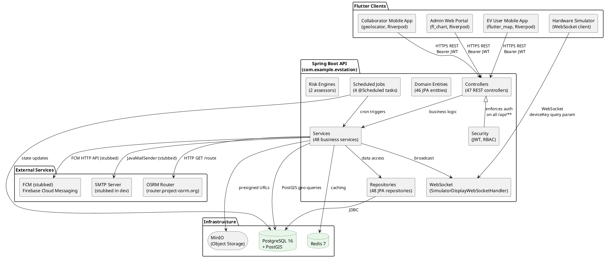
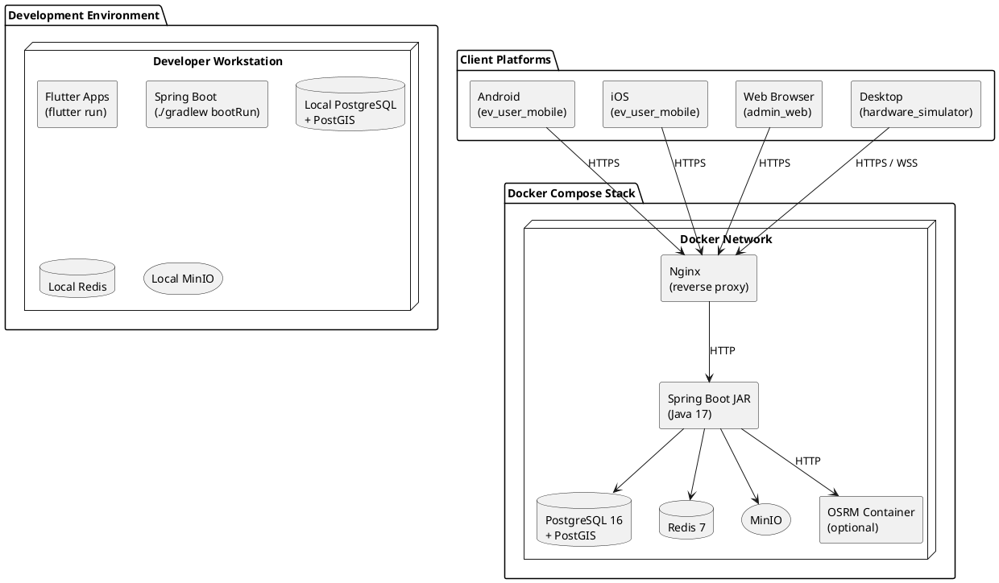

# DOC 2 — System Architecture

---

## 2.1 Overall Architecture Description

VoltGO follows a **client-server architecture** with a **layered / clean architecture** on the backend. The system is composed of:

1. **Flutter Clients** — Four independently deployed Flutter applications (three mobile/web apps + one simulator) that communicate with the backend exclusively over HTTP REST and WebSocket.

2. **Spring Boot API** — A monolithic REST API (Spring Boot 3.2.0, Java 17) organized into feature modules. It exposes HTTP endpoints for business operations and a WebSocket endpoint for real-time battery swap broadcasts.

3. **PostgreSQL 16 + PostGIS** — Relational database with spatial extension for geo-queries (Haversine distance, point-in-polygon).

4. **Redis 7** — In-memory cache for session data, rate limiting, and temporary state (e.g., booking hold tokens).

5. **MinIO** — S3-compatible object storage for file uploads (verification photos, station images) and presigned URL generation.

6. **Flyway** — Database migration manager handling all schema evolution through versioned SQL scripts.

7. **OSRM (Open Source Routing Machine)** — External HTTP routing service used by the EV User app to compute driving routes. Called server-to-server from `RoutingService`.

The frontend does NOT communicate directly with the database, Redis, or MinIO. All data flows through the Spring Boot API, which acts as the single gateway.

---

## 2.2 Component Diagram (PlantUML)

---

## 2.3 Deployment Architecture (PlantUML)

---

## 2.4 Key Architectural Decisions

| Decision | Choice | Why | Alternatives Considered |
|---|---|---|---|
| **Frontend framework** | Flutter | Single codebase for Android, iOS, Web, and Desktop (hardware simulator). Fast hot-reload accelerates development. Rich widget library. Strong ecosystem for maps and location. Riverpod provides compile-safe state management. Large community, well-documented. | React Native (weaker performance for custom UI, requires separate web bundler), Kotlin Multiplatform (younger ecosystem, smaller community in 2024), Swift/Obj-C for iOS only (requires maintaining two separate codebases) |
| **State management** | Riverpod | Compile-time safe (no runtime provider errors), testable, no code generation, first-class async/data-stream support, works across mobile and web. Chosen over Provider (too simple) and Bloc (too verbose for this scale). | Provider (no compile safety, relies on runtime errors), Bloc (too verbose for this scale, steep learning curve), GetX (magic under the hood, harder to unit-test) |
| **Backend framework** | Spring Boot 3 | Industry standard for enterprise Java. Rich ecosystem: Security, JPA, WebSocket, @Scheduling, SpringDoc. Active community. | Quarkus (lighter but smaller community), Micronaut (good performance but less Spring ecosystem integration), raw Java EE (excessive boilerplate) |
| **API style** | REST | Simple, well-understood, works with all clients including web. Natural fit for CRUD and async operations. | GraphQL (overkill for this use case, adds complexity), gRPC (good for microservices but poor browser support) |
| **Authentication** | JWT (Bearer token, 24h expiry) | Stateless, scalable, works across mobile and web. Token contains all auth info (userId, email, role, status). | Session cookies (stateful, harder to scale horizontally, problematic for mobile apps), OAuth2/OIDC (adds complexity, overkill for a single-application system), PASETO (newer but less library support) |
| **Database** | PostgreSQL 16 + PostGIS | PostgreSQL provides ACID compliance, rich indexing, JSON support. PostGIS enables Haversine distance queries for nearby station search without external GIS services. Strong Vietnamese community. | MySQL (no PostGIS equivalent, weaker JSON support), MongoDB (no spatial queries without external service), SQLite (not production-scalable) |
| **ORM** | Spring Data JPA (Hibernate) | Standard Spring Boot ORM. Repository pattern with auto-generated query methods. Type-safe JPQL. Entity lifecycle callbacks. | MyBatis (more SQL control, less domain model), Spring Data JDBC (less feature-rich for complex relationships), jOOQ (requires code generation) |
| **Migrations** | Flyway | Versioned SQL scripts in `classpath:db/migration/`. Integrates natively with Spring Boot. Supports rollback, repair, and baseline. 47 migration files covering full schema evolution. | Liquibase (XML/JSON configs, less SQL-native), manual SQL (error-prone, no versioning) |
| **Caching** | Redis 7 | Sub-millisecond reads. Used for session caching, rate limiting, temporary state. TTL-based expiry for booking holds and swap codes. Pub/Sub for real-time WebSocket broadcasts. Native Spring Data Redis integration. | In-memory EhCache (no persistence, no distributed support), Memcached (simpler, less features) |
| **Object storage** | MinIO (S3-compatible) | Self-hosted S3-compatible storage. Deploys in Docker. Presigned URL generation keeps large files off the API server. Used for verification photos, station images, ID card scans. | AWS S3 directly (vendor lock-in, costs money), local filesystem (no scalability, no presigned URLs), Cloudinary (good for images but not generic object storage) |
| **Real-time** | Spring WebSocket (STOMP) | Native Spring integration. `SimulatorDisplayWebSocketHandler` handles hardware simulator display connections. `deviceKey` query parameter for device authentication. Broadcasts swap codes and slot updates. | Server-Sent Events (one-way server→client only), Socket.IO (adds client JS dependency), raw WebSocket (no topic-based routing) |
| **Routing service** | OSRM (router.project-osrm.org) | Open-source, free, returns turn-by-turn routes as GeoJSON. Simple HTTP API. Used server-side by `RoutingService` for route calculation. | Google Maps Directions API (paid, requires API key), Mapbox Directions API (paid, requires API key), self-hosted OSRM (more control but needs separate infrastructure) |
| **Map rendering** | flutter_map (OpenStreetMap) | Open-source, no API key required, offline-capable, highly customizable markers and polygons. Fully compatible with `latlong2`. | Google Maps Flutter (requires paid API key, restrictive licensing), Apple Maps (iOS only) |
| **API documentation** | SpringDoc OpenAPI (Swagger UI) | Auto-generates OpenAPI 3 spec from Spring annotations. Interactive Swagger UI at `/swagger-ui/index.html`. | Springfox (deprecated, not updated for Spring Boot 3), manual Markdown (becomes outdated quickly) |
| **Deployment** | Docker Compose | All services containerized. `docker-compose.yml` orchestrates: Spring Boot JAR, PostgreSQL, Redis, MinIO, Nginx. Reproducible local dev and CI environment. | Kubernetes (too complex for thesis/prototype scale), bare VM (manual ops overhead), Heroku/Render (limited PostgreSQL + PostGIS support) |
| **Payment** | Mock / Simulated | `PaymentService` simulates payment flow via `simulate-success` and `simulate-fail` endpoints. `SwapPayment` entity tracks amount, status, and payment method field (ready for gateway integration). | VNPay (requires merchant account, bank partnership), MoMo (requires merchant account, only in Vietnam), Stripe (international, good DX) |
| **AI** | Rule-based / Heuristic | `EvUserAiService` computes recommendations using: Haversine distance, battery level, target level, estimated charging time. `RecommendationQueryService` optimizes for minimum total time (travel + charge). No ML model deployed. | TensorFlow Lite (requires training data, model management), remote AI API (adds latency and costs) |
