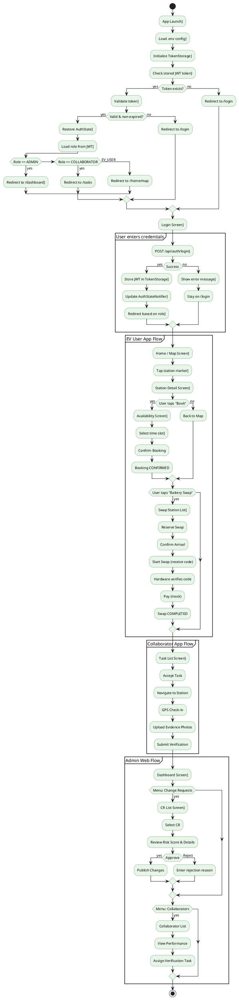

# DOC 6 — Frontend Structure (Flutter)

---

## 6.1 Repository Structure

The Flutter code is organized as a monorepo under `apps/` and `shared/`:

```
apps/
├── admin_web/          # Admin web portal (Flutter web)
├── collab_mobile/      # Collaborator mobile app
├── ev_user_mobile/     # EV user mobile app
└── hardware_simulator/ # Hardware display simulator
shared/
├── shared_ui/          # Reusable widgets, theme, common components
├── shared_auth/        # Auth state, token storage, auth service
├── shared_network/     # Dio HTTP client, error interceptors
└── shared_api/         # Generated API client from OpenAPI spec
```

Each app follows the same internal structure:

```
lib/
└── src/
    ├── main.dart           # App entry point
    ├── app.dart             # MaterialApp configuration
    ├── models/              # Data classes (freezed/manual)
    ├── providers/           # Riverpod providers (business logic)
    ├── repositories/        # Data access layer (calls shared_api)
    ├── routing/            # GoRouter configuration
    ├── screens/             # Full-page screens
    │   └── [feature]/
    │       ├── screen.dart
    │       └── widgets/     # Screen-specific widgets
    └── widgets/             # Shared widgets (also in shared_ui)
```

---

## 6.2 Shared Packages

### `shared_auth`

Provides authentication infrastructure consumed by all apps.

- **`auth_state.dart`** — Defines `AuthState` (userId, email, role, token, status) and `AuthStateNotifier` (Riverpod StateNotifier). Handles login, logout, token refresh.
- **`token_storage.dart`** — Platform-adaptive token storage using `SharedPreferences` on mobile and `html` `localStorage` on web. Reads `VoltGoEnv.tokenKey` for key name.
- **`auth_service.dart`** — Dio-based HTTP calls to `/api/auth/login` and `/api/auth/register`. On success, persists token via `TokenStorage` and updates `AuthStateNotifier`.

### `shared_network`

Provides the configured Dio HTTP client.

- **`dio_client.dart`** — Creates a `Dio` instance with:
  - Base URL from `VoltGoEnv.apiBaseUrl`
  - Connect timeout: 30s, receive timeout: 30s
  - `ErrorInterceptor` for parsing API error responses
  - Conditional `Web` adapter for web compatibility
  - Request/response logging (debug mode only)

### `shared_ui`

Reusable visual components used across all apps.

- **`theme/app_theme.dart`** — Defines `VoltGoTheme` using Material 3 `ColorScheme.fromSeed`. Primary seed color: `#2E7D32` (green energy theme). Text theme, `ElevatedButtonTheme`, `AppBarTheme`, and `InputDecorationTheme` customized.
- **`widgets/badges/score_badge.dart`** — Displays trust/risk scores as colored chips (green for high trust, orange for medium, red for low).
- **`widgets/scaffold/app_scaffold.dart`** — Reusable `Scaffold` with optional `AppBar`, `bottomNavigationBar`, and `body`. Supports a loading overlay state via `isLoading`.

### `shared_api`

Auto-generated from OpenAPI spec (via `openapi-generator-cli`). Provides typed API client classes for all endpoints, request DTOs, and response DTOs. All apps depend on this package for type-safe API calls.

---

## 6.3 State Management — Riverpod

**Architecture pattern:** All app state is managed via Riverpod providers. The pattern is:

1. **Model** (`models/`) — Plain Dart classes representing API responses.
2. **Repository** (`repositories/`) — Calls `shared_api`, handles raw JSON → model mapping.
3. **Provider** (`providers/`) — Riverpod providers that call repositories, handle loading/error states via `AsyncValue`, expose state to UI.

Example pattern (from `ev_user_mobile`):

```dart
// Model
class NearbyStation {
  final String id, name, address;
  final double latitude, longitude, distanceMeters;
  // ...
}

// Repository
class StationRepository {
  final ApiClient _api;
  Future<List<NearbyStation>> getNearby(double lat, double lng, double radius) async {
    final response = await _api.getNearbyStations(...);
    return NearbyStation.fromJson(response);
  }
}

// Provider (Riverpod)
final nearbyStationsProvider = FutureProvider.family<List<NearbyStation>, (double,double,double)>(
  (ref, params) => StationRepository().getNearby(...),
);
```

**Key providers used:**
- `authStateProvider` — Global auth state (token, user info, role).
- `apiClientProvider` — Configured Dio instance.
- `tokenStorageProvider` — Platform-adaptive token persistence.
- Feature-specific providers (e.g., `nearbyStationsProvider`, `bookingListProvider`, `loyaltyProfileProvider`).

---

## 6.4 Navigation — GoRouter

GoRouter provides declarative routing with role-based guards. The router is configured in each app's `routing/` directory.

**Key features:**
- **Deep linking:** Routes map directly to URLs (web) or paths (mobile).
- **Route guards:** `Redirect` callback checks `authStateProvider`. Unauthenticated users redirect to `/login`. Role mismatches redirect to `/unauthorized`.
- **Shell routes:** Admin web uses nested routes with `ShellRoute` for persistent side navigation.
- **Path parameters:** `/stations/:id`, `/bookings/:id`, etc.

**Route structure example (admin_web):**

```
/login
/
  /dashboard
  /stations
    /stations/list
    /stations/:id
    /stations/create
  /change-requests
    /change-requests/list
    /change-requests/:id
  /collaborators
  /verification
  /loyalty
  /issues
  /audit-log
```

**Route structure example (ev_user_mobile):**

```
/splash
/login
/register
/register?ref=CODE
/home (tab bar)
  /map (Tab 1)
  /bookings (Tab 2)
  /loyalty (Tab 3)
  /profile (Tab 4)
/stations/nearby
/stations/:id
/stations/:id/book
/battery-swap/stations
/battery-swap/:id/reserve
/battery-swap/:id/swap-flow
```

---

## 6.5 Navigation Flow Diagram (PlantUML)



---

## 6.6 Key Screens by Application

### EV User Mobile (`ev_user_mobile`)

| Screen | Description |
|---|---|
| **Splash** | App logo, env loading |
| **Login / Register** | Email+password auth, referral code on register |
| **Home / Map** | OpenStreetMap with station markers (charging + swap), filter panel |
| **Station Detail** | Station info, services, availability calendar, trust score badge, book/rate buttons |
| **Booking Flow** | Time slot selection, price summary, payment (mock), confirmation |
| **My Bookings** | List of HOLD/CONFIRMED/CANCELLED/EXPIRED bookings |
| **Battery Swap Stations** | Nearby swap stations with availability |
| **Swap Reserve** | Reserve flow, arrival confirmation, swap code display |
| **AI Recommendations** | Personalized station suggestions with estimated times |
| **Loyalty** | Points, tier, badges, vouchers, referral code |
| **Profile** | Edit name/phone, change password, FCM token, logout |

### Admin Web (`admin_web`)

| Screen | Description |
|---|---|
| **Dashboard** | Stats cards, booking trend chart (fl_chart), issue pie chart, collaborator leaderboard |
| **Station List** | Paginated table, search, filter by status, bulk import CSV |
| **Station Detail / Edit** | Form with tabs: info, ports, services, versions, audit log |
| **Change Requests** | List with status filter, risk score badge, approve/reject/publish actions |
| **Collaborators** | Table with performance metrics, GPS location map, contract management |
| **Verification Tasks** | Task creation, SLA tracking, evidence photo gallery |
| **Trust Scores** | Station trust overview table, factor breakdown chart |
| **Battery Swap Trust** | Swap station trust with category risk bars |
| **Loyalty Admin** | Badge CRUD, voucher CRUD, rating moderation, leaderboard |
| **Issues** | Issue list with category filter, resolution form |
| **Audit Log** | Full-text search across admin actions |
| **Registration Requests** | Review ID card images, approve/reject |

### Collaborator Mobile (`collab_mobile`)

| Screen | Description |
|---|---|
| **Splash / Login** | Email+password auth |
| **Task List** | Assigned verification tasks with SLA countdown |
| **Task Detail** | Station info, checklist items |
| **Check-in** | GPS capture + Haversine distance display |
| **Photo Upload** | Camera/gallery picker, category selection |
| **Task Submit** | Review checklist, submit for admin review |
| **Contracts** | Active/expired contract list |
| **Profile** | Edit profile, avatar upload |

### Hardware Simulator (`hardware_simulator`)

| Screen | Description |
|---|---|
| **Device Login** | Enter deviceKey from station registration |
| **Station Display** | Live slot status (AVAILABLE/OCCUPIED), swap code display, battery level bars |
| **Swap Flow** | Shows incoming swap code, accepts manual confirm |

---

## 6.7 Key Flutter Packages and Their Purpose

| Package | Version (range) | Purpose |
|---|---|---|
| `flutter_riverpod` | ^2.4 | Reactive state management, compile-time safe providers |
| `go_router` | ^13.x | Declarative routing with deep links and guards |
| `dio` | ^5.4 | HTTP client with interceptors, retry, and timeout |
| `shared_ui` | `../shared/shared_ui` | Custom theme, reusable widgets (badges, scaffold) |
| `shared_auth` | `../shared/shared_auth` | Auth state, token storage, login service |
| `shared_network` | `../shared/shared_network` | Dio client factory |
| `shared_api` | `../shared/shared_api` | Generated OpenAPI client |
| `flutter_map` | latest | OpenStreetMap map rendering |
| `latlong2` | latest | Coordinate types, Haversine distance |
| `fl_chart` | ^0.66 | Admin dashboard charts (line, bar, pie) |
| `geolocator` | ^11.x | GPS location access |
| `image_picker` | latest | Camera/gallery photo selection |
| `cached_network_image` | latest | Image caching for station photos |
| `file_picker` | latest | CSV file selection for bulk import |
| `flutter_dotenv` | latest | Environment variable loading from `.env` |
| `intl` | latest | Date/time formatting |
| `percent_indicator` | latest | Progress bars for trust scores, loyalty tiers |
| `url_launcher` | latest | Open external URLs (phone, maps) |
| `share_plus` | latest | Share referral codes, station links |
| `freezed_annotation` | ^2.4 | Immutable data classes (used in models) |
| `json_annotation` | ^4.8 | JSON serialization annotations |

---

## 6.8 Environment Configuration (`.env`)

Each app uses `flutter_dotenv` to load environment variables from a `.env` file:

```env
# EV User Mobile
API_BASE_URL=http://10.0.2.2:8080/api
TOKEN_KEY=voltgo_token
OSRM_BASE_URL=http://router.project-osrm.org

# Admin Web
API_BASE_URL=http://localhost:8080/api

# Hardware Simulator
API_BASE_URL=http://localhost:8080
WS_BASE_URL=ws://localhost:8080

# Collaborator Mobile
API_BASE_URL=http://10.0.2.2:8080/api
```
