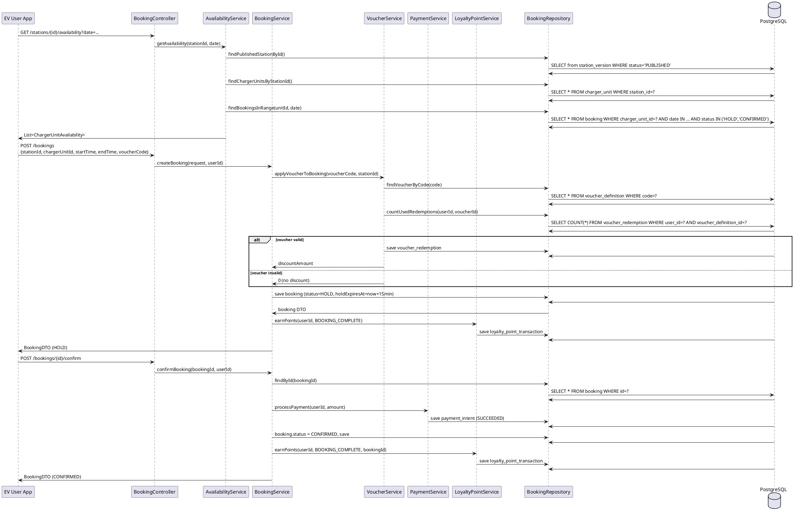
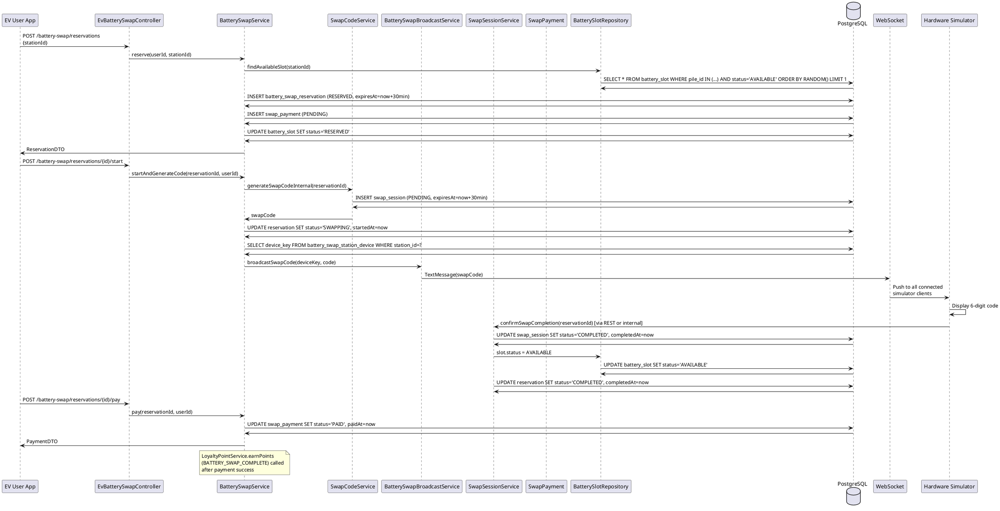
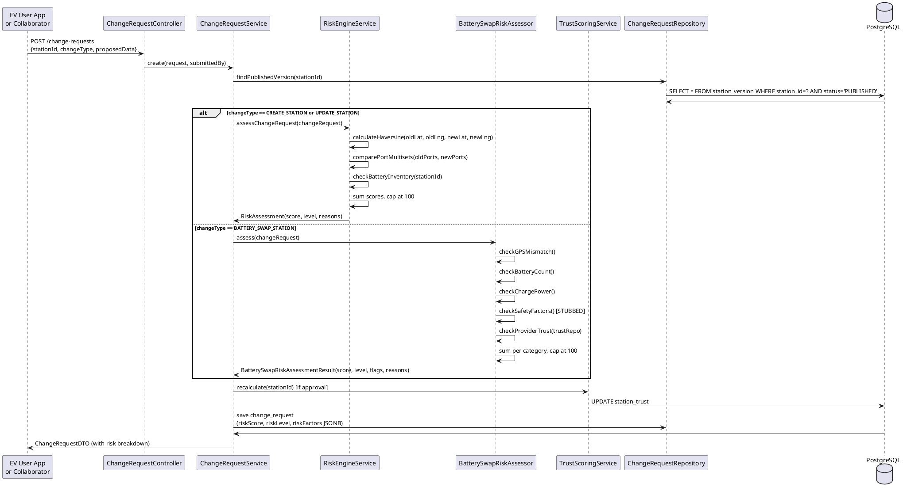
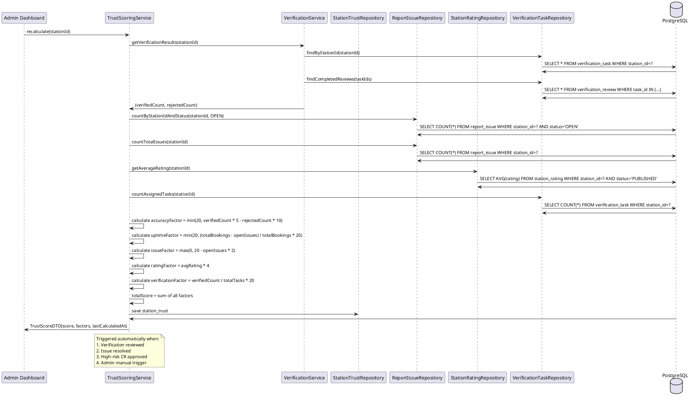
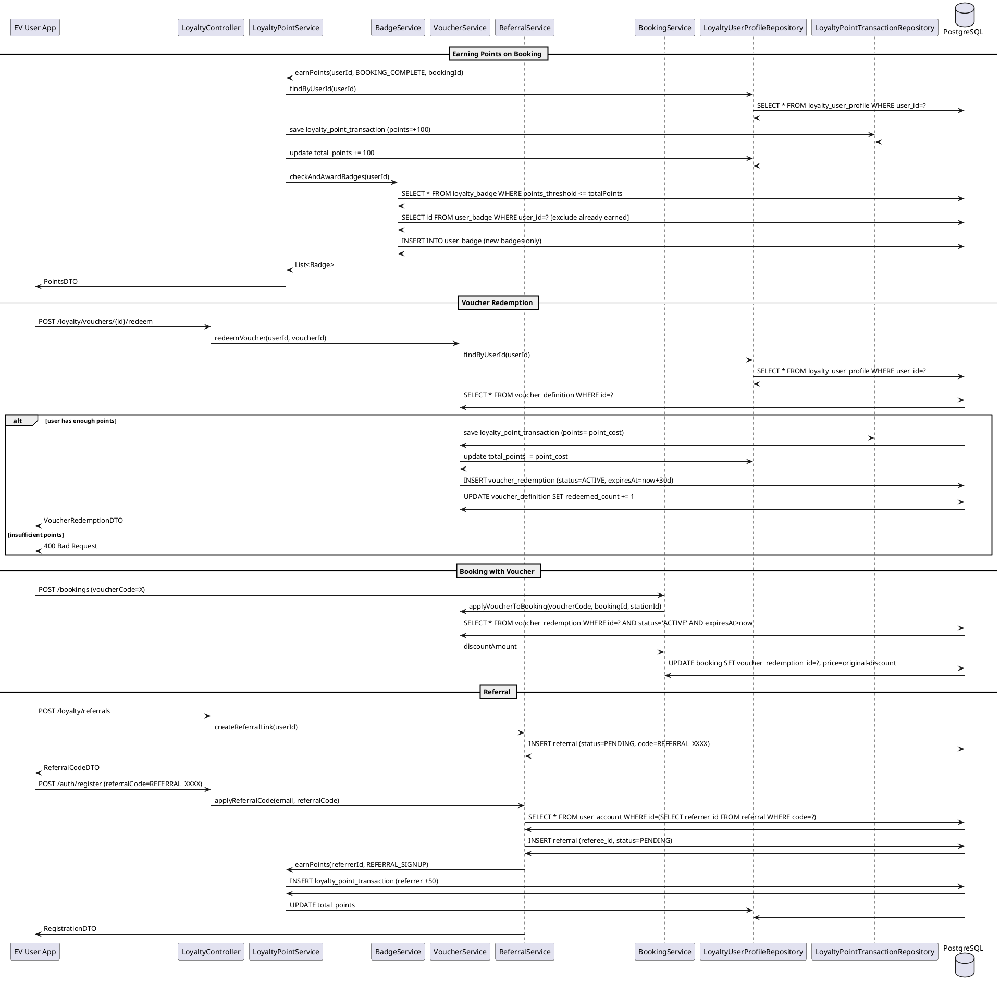
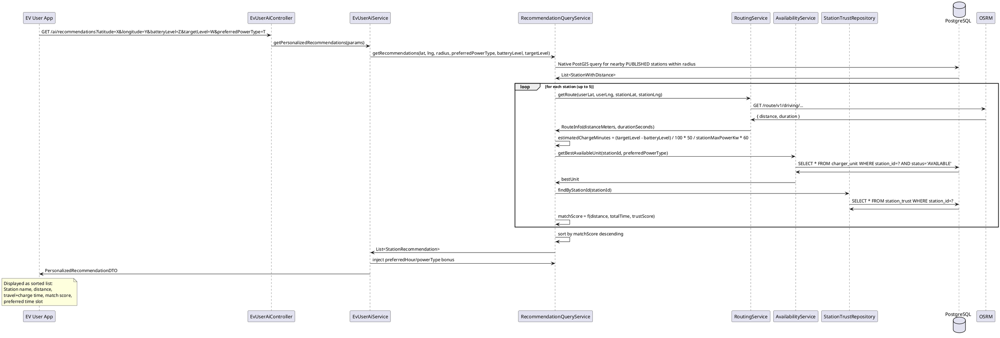

# DOC 8 — Key Features Implementation Detail

This document covers 6 selected features in depth: Booking System, Battery Swap Workflow, Station Risk Assessment, Trust Scoring, Loyalty & Rewards, and AI Recommendations.

---

## Feature 1 — Charging Booking System

### Feature Name
Charging Booking System

### User-Facing Behavior

An EV driver opens the app, browses the map or searches for a station, selects a charger unit, chooses a 30-minute time slot from an availability grid, and confirms the booking. The booking enters a **HOLD** state for 15 minutes — if the user doesn't confirm within that window, the slot is released automatically. Upon confirmation, the booking moves to **CONFIRMED** and the user can view it in "My Bookings."

### Backend Logic

**1. Availability Query (`AvailabilityService.getAvailability`)**
- Uses native PostGIS SQL to find `AVAILABLE` charger units at the station for the target date.
- Builds a 30-minute slot grid for each unit from operating hours.
- Checks `booking` table for existing `HOLD` or `CONFIRMED` bookings overlapping each slot.
- Slot status: `AVAILABLE` (no overlap), `OCCUPIED` (has booking), `OUT_OF_SERVICE` (unit marked down).

**2. Booking Creation (`BookingService.createBooking`)**
- Validates: unit exists, unit is `AVAILABLE`, no time conflict (PostgreSQL exclusion constraint `ck_booking_no_overlap_active`).
- If a voucher code is provided, `VoucherService.applyVoucherToBooking` calculates the discount and records redemption.
- Creates `Booking` entity with status `HOLD` and `holdExpiresAt = now + 15 minutes`.
- Returns booking DTO with hold expiry time.

**3. Booking Confirmation (`BookingService.confirmBooking`)**
- Validates: booking is in `HOLD` state, `holdExpiresAt` not passed.
- Calls `PaymentService.processPayment` (mock: creates `PaymentIntent` with `SUCCEEDED`).
- Updates booking status to `CONFIRMED`, clears `holdExpiresAt`.
- Awards loyalty points via `LoyaltyPointService.earnPoints` with source `BOOKING_COMPLETE`.

**4. Booking Expiry (`ExpireBookingJob`)**
- Runs every 60 seconds.
- Query: `findExpiredHolds(Instant.now())` — all `HOLD` bookings where `holdExpiresAt < now`.
- Sets status to `EXPIRED`. Slot is released for new bookings.

**5. Cancellation (`BookingService.cancelBooking`)**
- Validates: booking is `HOLD` or `CONFIRMED` (not yet started).
- Sets status to `CANCELLED`.
- No points reversal in current implementation.

### Relevant DB Tables

| Table | Role |
|---|---|
| `booking` | Core booking records with status, slot, price |
| `charger_unit` | Unit being booked (status checked) |
| `station` | Station context |
| `user_account` | Booking owner |
| `voucher_redemption` | Applied discount (if any) |
| `payment_intent` | Mock payment record |

### Sequence Diagram (PlantUML)



---

## Feature 2 — Battery Swap Workflow

### Feature Name
Battery Swap Station Reservation and Swap Flow

### User-Facing Behavior

An EV driver locates a nearby battery swap station on the map, reserves a battery slot, drives to the station, confirms arrival in the app, and presses "Start Swap." The hardware display shows a 6-digit code. The driver confirms the code matches the app, inserts their depleted battery, and the hardware swaps it with a charged battery. The driver pays (mock) and completes the transaction.

### Backend Logic

**1. Nearby Swap Stations (`BatterySwapService.getNearbySwapStations`)**
- Native PostGIS SQL: `ST_DWithin(location, ST_MakePoint(lng, lat)::geography, radius)`.
- Returns stations sorted by distance, enriched with `total_batteries`, `available_batteries`, `base_price`.
- **Updated 2026-06-20:** JOIN strategy refactored from `bsv.id = sv.id` (incorrect for V124/V125 VoltGo seed data, where `bsv.id != sv.id`) to `bsv.station_id = sv.station_id` + `JOIN station` + `JOIN station_service WHERE service_type = 'BATTERY_SWAP'`. Response now includes `providerId` (nullable) for each station so admin UI can attribute VoltGo-owned vs partner-imported stations. SQL named parameters `:lat/:lng` replaced with positional `?` to avoid conflicts with PostGIS `::text` casts (Hibernate binds them in `setParameter()` order).

**2. Reservation (`BatterySwapService.reserve`)**
- Finds an `AVAILABLE` battery slot at the station (random if multiple).
- Creates `BatterySwapReservation` with status `RESERVED` and `expiresAt = now + 30 minutes`.
- Creates `SwapPayment` with status `PENDING`.
- Updates `battery_slot` status to `RESERVED`.
- If user has a loyalty profile, awards `BATTERY_SWAP_RESERVATION` points.

**3. Arrival Confirmation (`BatterySwapService.confirmArrival`)**
- Updates reservation `confirmedArrivalAt = now`.
- Status stays `RESERVED`; next step is `startSwap`.

**4. Start Swap — Code Generation (`BatterySwapService.startAndGenerateCode`)**
- Calls `SwapCodeService.generateSwapCodeInternal(reservationId)`:
  - Generates a random 4-digit numeric code.
  - Creates `SwapSession` entity with status `PENDING`, `expiresAt = now + 30 minutes`.
  - Stores the code in `swap_session.swap_code`.
- Updates reservation status to `SWAPPING`, sets `startedAt`.
- Calls `BatterySwapBroadcastService.broadcastSwapCode(stationId, code)`:
  - Looks up `battery_swap_station_device` by stationId to get `deviceKey`.
  - Broadcasts via WebSocket to connected hardware simulator clients.

**5. Hardware Verification**
- The hardware simulator (connected via WebSocket) receives the broadcast and displays the code.
- The hardware operator visually confirms the code matches, completes the physical swap, and presses "Confirm" on the hardware display.
- Hardware calls `SwapSessionService.confirmSwapCompletion(reservationId)`:
  - Validates: reservation is `SWAPPING`, swap code exists.
  - Updates `battery_slot` status to `AVAILABLE` (charged battery inserted).
  - Updates `swap_session.status = COMPLETED`, sets `completedAt`.
  - Updates `battery_swap_reservation.status = COMPLETED`, sets `completedAt`.

**6. Payment (`BatterySwapService.pay`)**
- Mock: updates `swap_payment.status = PAID`, `paidAt = now`.
- Awards loyalty points via `LoyaltyPointService.earnPoints` with source `BATTERY_SWAP_COMPLETE`.

**7. Expiry Job (`ExpireBatterySwapReservationsJob`)**
- Runs every 60 seconds.
- Finds `RESERVED` reservations past `expiresAt`, sets status to `EXPIRED`, releases slots.
- `SwapCodeService.expirePendingSessions()` finds `PENDING` sessions past `expires_at`, sets status to `EXPIRED`.

### Relevant DB Tables

| Table | Role |
|---|---|
| `battery_swap_reservation` | Core reservation record with status lifecycle |
| `battery_slot` | Physical battery slot (AVAILABLE/RESERVED/OCCUPIED/MAINTENANCE) |
| `swap_session` | Swap code and session lifecycle (PENDING/ACTIVE/COMPLETED/EXPIRED) |
| `swap_payment` | Mock payment record |
| `battery_swap_station_state` | Station-level battery inventory |
| `battery_swap_station_device` | Hardware simulator device key for WebSocket |
| `swap_pile` | Pile grouping slots |
| `loyalty_user_profile` | Points award target |
| `loyalty_point_transaction` | Points transaction log |

### Sequence Diagram (PlantUML)



---

## Feature 3 — Station Risk Assessment Engine

### Feature Name
Station Risk Assessment Engine (Standard + Battery Swap)

### User-Facing Behavior

A user or **collaborator** submits a change request (e.g., updates station hours or adds a charging port). The system immediately calculates a risk score. Low-risk changes (score < 30) can be auto-approved by admin review. High-risk changes (score >= 50) require thorough investigation. The risk score and breakdown are visible to the admin in the change request review screen.

> **2026-06 update:** Collaborators can now create and submit change requests for both charging and battery-swap stations through a new *Requests* tab in the collaborator mobile app. Each CR passes through the same risk engine and notifies the submitter on every admin decision (approve / reject / publish).
>
> **2026-06-14 update:** The Create-CR form now supports *station search & auto-fill* — collaborators type a station name and pick a match to pre-populate name/address/GPS/hours/ports (and battery-swap details if the station supports the service).
>
> **2026-06-20 update:** `stationData.parking` is now optional in `CreateChangeRequestDTO` (no `@NotNull`). The service layer in `ChangeRequestService` falls back to `ParkingType.UNKNOWN` if the user omits parking. Rationale: a CR may only edit hours / address / ports and shouldn't be forced to pick a parking type.

### Backend Logic

**Standard Station Risk Engine (`RiskEngineService.assessChangeRequest`)**

Evaluates `CREATE_STATION` and `UPDATE_STATION` change requests. Triggers reasons:

| Risk Reason | Score | Check Logic |
|---|---|---|
| `NEW_STATION` | +10 | Any `CREATE_STATION` request |
| `GPS_CHANGED_100M` | +50 | Haversine distance between old and new lat/lng > 100m |
| `PORTS_CHANGED` | +30 | Multiset of (powerType, powerKw, count) differs between old and new port config |
| `SWAP_LOW_INVENTORY` | +30 | Battery swap totalBatteries < 5 |
| `SWAP_CONFIG_CHANGED` | +30 | totalBatteries or avgChargePowerKw changed |
| `SWAP_AVG_POWER_OUT_OF_RANGE` | +20 | avgChargePowerKw < 10 or > 200 |
| `HOURS_CHANGED` | +10 | Operating hours string differs |
| `ACCESS_CHANGED` | +10 | Visibility or publicStatus changed |

Score = sum of all triggered reasons, capped at 100.

**Battery Swap Risk Engine (`BatterySwapRiskAssessor.assess`)**

Evaluates battery swap station change requests. Organized into 6 categories:

| Category | Max Score | Key Triggers |
|---|---|---|
| Location Risks | 110 | GPS mismatch (+40), sensitive area (+25), new station (+15) |
| Data Accuracy Risks | 85 | Pile config changed (+25), battery count changed (+20), charge power changed (+20) |
| Operation Risks | 90 | Low battery inventory (+30), abnormal charge power (+25), limited availability (+15) |
| Financial Risks | 55 | Price significantly changed (+20), missing price info (+15) |
| Safety Risks | 90 | Safety concern (+35), missing safety equipment (+30), environmental risk (+25) — **ALL STUBS** |
| Provider Trust Risks | 80 | Low trust provider (+25), high rejection rate (+20), new provider (+20) — **PARTIAL STUBS** |

Flags derived from score:
- `autoApprovable`: score < 20
- `requiresVerification`: score >= 20
- `requiresAdminReview`: score >= 50

**Risk assessment is called** when a change request is submitted (`ChangeRequestService.create`) and stored in the `change_request` entity as `riskScore`, `riskLevel`, and `riskFactors` (JSONB).

### Relevant DB Tables

| Table | Role |
|---|---|
| `change_request` | Stores `riskScore`, `riskLevel`, `riskFactors` JSONB |
| `station_version` | Current published version for comparison |
| `station` | Station metadata |
| `battery_swap_station_version` | Battery swap station version |
| `battery_swap_station_state` | Current battery inventory for risk checks |
| `battery_swap_trust` | Provider trust data |

### Sequence Diagram (PlantUML)



---

## Feature 4 — Station Trust Scoring

### Feature Name
Station Trust Scoring System

### User-Facing Behavior

Every charging station has a trust score (0–100) displayed on the map and station detail screen. Higher trust scores appear more prominently. Admins can view the full breakdown and manually recalculate trust for any station.

### Backend Logic

**Trust Score Calculation (`TrustScoringService.recalculate`)**

Triggered after:
- A verification task is approved (`VerificationService.reviewTask`)
- An issue is resolved
- A high-risk change request is approved
- Manual recalculation via admin API

**Components and calculation:**

| Factor | Weight | Data Source |
|---|---|---|
| **Accuracy** | 20% | Based on verification results. Each `VERIFIED` task adds +5, each `REJECTED` task subtracts -10 |
| **Uptime** | 20% | Derived from issue rate. `open_issues / total_bookings` ratio |
| **Issue Rate** | 20% | Lower issue count = higher score. Score = max(0, 20 - issueCount * 2) |
| **User Ratings** | 20% | Average of `PUBLISHED` ratings. `avgRating * 4` (5-star → 20) |
| **Verification** | 20% | Fraction of successful verifications vs. total assigned |

```
totalScore = accuracyFactor + uptimeFactor + issueFactor + ratingFactor + verificationFactor
```

Range: 0–100.

**Battery Swap Trust (`BatterySwapTrustScoringService.recalculate`)**

Similar but separate, using the battery swap risk engine's per-category scores:

```
locationRisk = from BatterySwapRiskAssessor
dataAccuracyRisk = from BatterySwapRiskAssessor
operationRisk = from BatterySwapRiskAssessor
financialRisk = from BatterySwapRiskAssessor
safetyRisk = from BatterySwapRiskAssessor (mostly stubs)
providerTrustRisk = from BatterySwapTrustAssessor
totalScore = 100 - sum(categoryRisks)
```

Risk levels: `MINIMAL` (< 10), `LOW` (10–30), `MEDIUM` (30–50), `HIGH` (>= 50).

### Relevant DB Tables

| Table | Role |
|---|---|
| `station_trust` | Stores score and per-factor breakdown |
| `battery_swap_trust` | Stores swap station score and category risks |
| `verification_task` / `verification_review` | Source data for accuracy factor |
| `report_issue` | Source data for issue factor |
| `station_rating` | Source data for rating factor |

### Sequence Diagram (PlantUML)



---

## Feature 5 — Loyalty & Rewards System

### Feature Name
Loyalty & Rewards System (Points, Tiers, Badges, Vouchers, Referrals)

### User-Facing Behavior

Users earn points automatically: for completed bookings, battery swaps, successful referrals, and rating stations. Points are displayed in the Loyalty tab. Users redeem points for vouchers (discount codes) which are applied at booking time. Tiers (Bronze → Diamond) unlock as total points grow. Badges are awarded for milestones.

### Backend Logic

**Point Earning (`LoyaltyPointService.earnPoints`)**

Triggered on:
- Booking confirmation: `BOOKING_COMPLETE` → +100 points
- Battery swap completion: `BATTERY_SWAP_COMPLETE` → +50 points
- Referral signup: `REFERRAL_SIGNUP` → +50 points
- Referral completion: `REFERRAL_COMPLETE` → +200 points
- Rating submission: `RATING_BONUS` → +20 points
- Admin adjustment: `ADMIN_ADJUSTMENT` → variable

On each earn:
1. Debit `loyalty_point_transaction` table (positive `points`).
2. Update `loyalty_user_profile.total_points`.
3. Call `BadgeService.checkAndAwardBadges(userId)`.

**Tier Calculation**

Automatically computed from `total_points`:
- Bronze: 0+
- Silver: 500+
- Gold: 2,000+
- Platinum: 5,000+
- Diamond: 10,000+

No explicit tier table — computed on-the-fly from `total_points`.

**Badge Award (`BadgeService.checkAndAwardBadges`)**

Badge definitions stored in `loyalty_badge` table with `points_threshold`. On each points transaction:

1. Query all `loyalty_badge` where `points_threshold <= totalPoints`.
2. Filter out already-earned badges (check `user_badge` table).
3. Insert new `user_badge` records.
4. Return newly awarded badges.

**Voucher Redemption (`VoucherService.redeemVoucher`)**

1. Validate: voucher exists, active, not expired, redeemed count < total quantity, user has enough points.
2. Deduct `point_cost` from `loyalty_user_profile.total_points`.
3. Insert `loyalty_point_transaction` (negative points).
4. Insert `voucher_redemption` with `status=ACTIVE`, `expiresAt = now + 30 days`.
5. Increment `voucher_definition.redeemed_count`.

**Voucher Application**

- `VoucherService.applyVoucherToBooking`: If `voucher_type == BOOKING_DISCOUNT`, calculate `discount_amount = booking_price * discount_percent / 100` (capped at `max_discount_vnd`). Store redemption on booking.
- `VoucherService.applyVoucherToSwap`: Similar for swap reservations.

**Referral System (`ReferralService`)**

- User generates a referral code (`REFERRAL_XXXX`).
- On new user registration with a referral code:
  1. Find referrer by code.
  2. Create `referral` with status `PENDING`.
  3. Award 50 points to referrer (`REFERRAL_SIGNUP`).
- When referee completes first booking:
  1. Award 200 points to referrer (`REFERRAL_COMPLETE`).
  2. Award 100 points to referee.
  3. Set referral status to `COMPLETED`.

### Relevant DB Tables

| Table | Role |
|---|---|
| `loyalty_user_profile` | User points balance and tier |
| `loyalty_point_transaction` | Points ledger (all earn/redeem events) |
| `loyalty_badge` | Badge definitions |
| `user_badge` | User-badges many-to-many |
| `voucher_definition` | Voucher templates |
| `voucher_redemption` | User-redeemed vouchers |
| `referral` | Referrer-referee relationships |

### Sequence Diagram (PlantUML)



---

## Feature 6 — AI-Powered Station Recommendations

### Feature Name
AI-Powered Station Recommendations

### User-Facing Behavior

An EV driver enters their current location and battery level, selects a target charge level, and receives a personalized list of recommended stations. Each recommendation shows estimated travel time, charging time, total time, trust score, and a "match score" that reflects how well the station fits the user's needs.

### Backend Logic

**Personalized Recommendations (`EvUserAiService.getPersonalizedRecommendations`)**

1. Extracts user preferences: preferred operating hour, preferred power type.
2. Calls `RecommendationQueryService.getRecommendations` with those preferences injected.
3. Sorts results by `matchScore` (computed from total time + preference bonus).

**Recommendation Query (`RecommendationQueryService.getRecommendations`)**

The core recommendation algorithm:

**Step 1 — Nearby Stations (PostGIS)**
```sql
SELECT s.*, sv.latitude, sv.longitude,
  ST_Distance(sv.location, ST_MakePoint(:lng, :lat)::geography) AS distance_meters
FROM station s
JOIN station_version sv ON sv.station_id = s.id
WHERE sv.status = 'PUBLISHED'
  AND sv.visibility = 'PUBLIC'
  AND ST_DWithin(sv.location, ST_MakePoint(:lng, :lat)::geography, :radius)
ORDER BY distance_meters ASC
```

**Step 2 — OSRM Route Calculation**
For each station (up to 5), calls OSRM:
```
GET https://router.project-osrm.org/route/v1/driving/{lng},{lat};{sLng},{sLat}?overview=false
```
Parses `routes[0].distance` (meters) and `routes[0].duration` (seconds).

**Step 3 — Charging Time Estimation**
```
neededKwh = (targetLevel - currentLevel) / 100 * vehicleCapacityKwh
estimatedChargeMinutes = neededKwh / stationMaxPowerKw * 60
```
Uses a default `vehicleCapacityKwh = 50.0` if not provided.

**Step 4 — Port Availability Evaluation**
For each station, finds the best available charger unit that matches the preferred power type:
```java
var bestUnit = chargerUnits.stream()
    .filter(u -> u.getStatus() == ChargerUnitStatus.AVAILABLE)
    .filter(u -> preferredPowerType == null || u.getPowerKw() >= preferredPowerType)
    .min(Comparator.comparing(ChargerUnit::getPowerKw)) // prefer smaller (available) units
    .orElse(null);
```

**Step 5 — Trust Score Lookup**
Joins `station_trust` for `score` and uses it as a factor in `matchScore`.

**Step 6 — Match Score Calculation**
```
matchScore = (100 - distanceFactor * 0.3) + (100 - totalTimeFactor * 0.4) + trustFactor * 0.3
```
Where:
- `distanceFactor = distanceMeters / 1000` (km)
- `totalTimeFactor = totalMinutes` (travel + charge)
- `trustFactor = trustScore`

Capped at 100. Stations sorted descending by `matchScore`.

**Smart Time Suggestions (`EvUserAiService.getSmartTimeSuggestions`)**
- Predicts load based on historical booking patterns (computed from `booking` table for last 30 days).
- Suggests off-peak hours to minimize wait time.
- Applies a preference bonus if the suggested time matches the user's preferred operating hour.

### Relevant DB Tables

| Table | Role |
|---|---|
| `station` / `station_version` | Station data and location |
| `charger_unit` | Unit power and availability |
| `station_trust` | Trust score for match scoring |
| `booking` | Historical data for load prediction |

### Sequence Diagram (PlantUML)



---

## Summary: Features and Their Key Entities

| Feature | Key Entities | Key Services | Key Repositories |
|---|---|---|---|
| **Booking System** | `Booking`, `ChargerUnit`, `PaymentIntent`, `VoucherRedemption` | `BookingService`, `AvailabilityService`, `PaymentService` | `BookingRepository`, `ChargerUnitRepository` |
| **Battery Swap** | `BatterySwapReservation`, `SwapSession`, `BatterySlot`, `SwapPayment` | `BatterySwapService`, `SwapSessionService`, `SwapCodeService`, `BatterySwapBroadcastService` | `BatterySwapReservationRepository`, `SwapSessionRepository`, `BatterySlotRepository` |
| **Risk Assessment** | `ChangeRequest`, `StationVersion`, `BatterySwapStationVersion` | `RiskEngineService`, `BatterySwapRiskAssessor` | `ChangeRequestRepository` |
| **Trust Scoring** | `StationTrust`, `BatterySwapTrust`, `VerificationTask`, `ReportIssue` | `TrustScoringService`, `BatterySwapTrustScoringService` | `StationTrustRepository`, `VerificationTaskRepository` |
| **Loyalty & Rewards** | `LoyaltyUserProfile`, `LoyaltyPointTransaction`, `LoyaltyBadge`, `UserBadge`, `VoucherDefinition`, `VoucherRedemption`, `Referral` | `LoyaltyPointService`, `BadgeService`, `VoucherService`, `ReferralService` | `LoyaltyUserProfileRepository`, `VoucherDefinitionRepository` |
| **AI Recommendations** | `Station`, `ChargerUnit`, `StationTrust`, `Booking` | `RecommendationQueryService`, `EvUserAiService`, `RoutingService` | `StationRepository`, `ChargerUnitRepository` |
